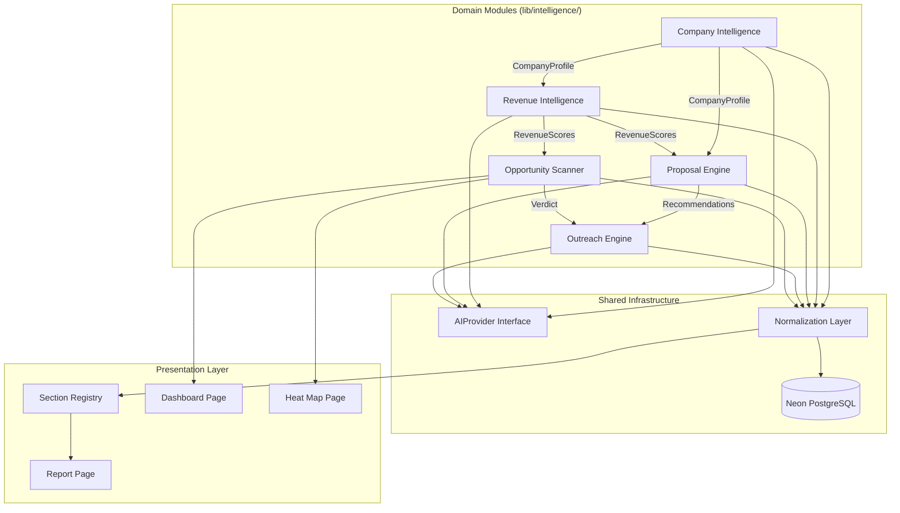
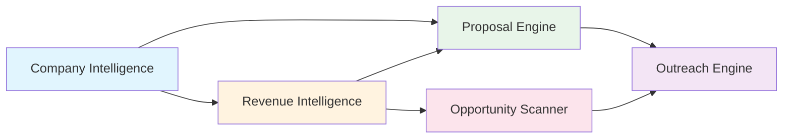
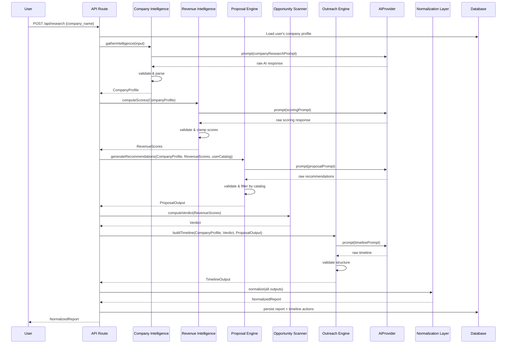
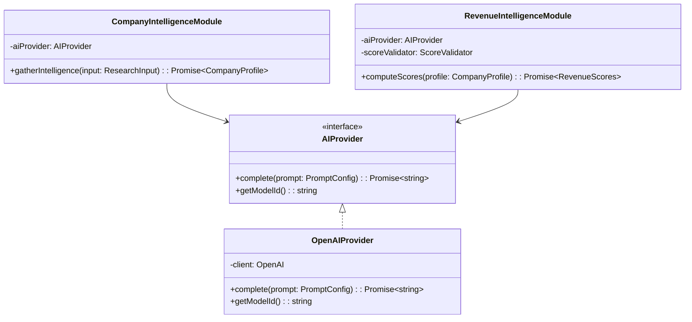

# Design Document: Revenue Intelligence Engine (v0.4)

## Overview

The Revenue Intelligence Engine transforms SalesPilot AI from an AI writing tool into an AI Revenue Consultant. It answers four questions for every researched company: **Should I contact them? What should I sell? How much is this opportunity worth? What should I do next?**

### Core Design Philosophy

The system is decomposed into **5 independent domain modules**, each owning a specific slice of intelligence:

1. **Company Intelligence** — Research, company data gathering, digital presence analysis
2. **Revenue Intelligence** — Scoring engine, deal sizing, urgency computation
3. **Opportunity Scanner** — AI verdict, heat map aggregations, dashboard metrics
4. **Proposal Engine** — Service recommendations, sales blueprint, objection intelligence
5. **Outreach Engine** — AI timeline, contact scheduling, channel selection

Each module exposes a typed interface, consumes structured data (never raw AI output), and can be replaced independently via dependency injection.

### Key Architectural Decisions

| Decision | Rationale |
|----------|-----------|
| 5-module domain separation | Each concern evolves independently; scoring logic changes won't touch outreach scheduling |
| Abstract AI provider interface | OpenAI today, Claude/Gemini/local models tomorrow — zero business logic changes |
| Scoring isolated from prompts | Prompt construction (what to ask) is separate from score computation (how to validate/interpret) |
| Normalized report model between AI and UI | Frontend never sees raw AI JSON; a transformation layer ensures schema stability |
| Section registry pattern for report UI | New AI analyses require only a registry entry, not page-level code changes |
| Enriched score structure | Every score carries value + explanation + confidence + evidence for full auditability |

### What Changes from v0.3

The current codebase (`lib/ai.ts`) is a single 400-line file that directly constructs OpenAI prompts, calls the API, and returns typed JSON. The frontend pages (`research/page.tsx`, `dashboard/page.tsx`) render hardcoded sections. This design replaces that with:

- A modular `lib/intelligence/` directory with one file per domain
- An `AIProvider` interface abstracting all LLM calls
- A `ReportModel` normalized layer between AI output and UI consumption
- A `SectionRegistry` driving dynamic report rendering

## Architecture

### High-Level Module Boundaries



### Module Dependency Flow



### Request Flow — Full Report Generation



### Dependency Injection Pattern

All modules receive their dependencies through constructor injection, enabling independent replacement:



## Components and Interfaces

### Shared Infrastructure Interfaces

#### AIProvider Interface

```typescript
// lib/intelligence/ai-provider.ts

export interface PromptConfig {
  systemPrompt: string;
  userPrompt: string;
  temperature?: number;
  maxTokens?: number;
  responseFormat?: 'json' | 'text';
}

export interface AIProviderResponse {
  content: string;
  model: string;
  tokensUsed: number;
}

export interface AIProvider {
  complete(config: PromptConfig): Promise<AIProviderResponse>;
  getModelId(): string;
  getProviderName(): string;
}
```

#### Enriched Score Structure

Every score in the system follows this structure:

```typescript
// lib/intelligence/types/score.ts

export interface EnrichedScore {
  value: number;           // The numeric score (0-100 or other range)
  explanation: string;     // AI reasoning for this score
  confidence: number;      // 0-100, how confident the AI is
  evidence: string[];      // Supporting data points
}
```

#### Normalization Layer Interface

```typescript
// lib/intelligence/normalization.ts

export interface NormalizationLayer {
  normalizeReport(raw: RawReportParts): NormalizedReport;
  denormalizeForStorage(report: NormalizedReport): StoragePayload;
  hydrateFromStorage(row: DatabaseRow): NormalizedReport;
}

export interface RawReportParts {
  companyProfile: CompanyProfile;
  revenueScores: RevenueScores;
  proposalOutput: ProposalOutput;
  verdict: Verdict;
  timeline: TimelineOutput;
}
```

---

### Module 1: Company Intelligence

Responsible for gathering and structuring company data from AI analysis.

```typescript
// lib/intelligence/company-intelligence/types.ts

export interface ResearchInput {
  companyName: string;
  website?: string;
  industry?: string;
  country?: string;
  notes?: string;
}

export interface CompanyProfile {
  executiveSummary: string;
  overview: {
    industry: string;
    businessModel: string;
    productsServices: string;
    targetMarket: string;
    estimatedSize: 'Startup' | 'SMB' | 'Mid-market' | 'Enterprise';
    growthStage: 'Early' | 'Growth' | 'Mature' | 'Declining';
  };
  technologyStack: {
    websitePlatform: string;
    analytics: string;
    marketingTools: string;
    crm: string;
    otherTools: string;
  };
  digitalPresence: {
    websiteQuality: 'Poor' | 'Average' | 'Good' | 'Excellent';
    seoAssessment: string;
    socialMedia: Record<string, 'Active' | 'Inactive' | 'Not found'>;
    contentActivity: string;
  };
  businessSignals: {
    hiring: string;
    funding: string;
    expansion: string;
    partnerships: string;
    news: string;
  };
  painPoints: Array<{ pain: string; reasoning: string }>;
  confidence: { level: 'High' | 'Medium' | 'Low'; limitations: string };
}

// lib/intelligence/company-intelligence/index.ts

export interface CompanyIntelligenceModule {
  gatherIntelligence(input: ResearchInput): Promise<CompanyProfile>;
}
```

---

### Module 2: Revenue Intelligence

Responsible for all scoring computations. Separates prompt construction from score validation.

```typescript
// lib/intelligence/revenue-intelligence/types.ts

export interface RevenueScores {
  revenuePotential: EnrichedScore;      // 0-100
  dealSize: {
    min: number;                         // USD
    max: number;                         // USD
    explanation: string;
    confidence: number;
    evidence: string[];
  };
  urgency: EnrichedScore;               // 0-100
  decisionMakerConfidence: EnrichedScore; // 0-100
  competitionRisk: EnrichedScore;       // 0-100

  // Preserved v0.3 scores
  opportunityScore: EnrichedScore;      // 0-100
  buyingIntent: {
    level: 'Low' | 'Medium' | 'High';
    explanation: string;
    confidence: number;
    evidence: string[];
  };
  digitalMaturity: EnrichedScore;       // 0-100
}

// lib/intelligence/revenue-intelligence/index.ts

export interface RevenueIntelligenceModule {
  computeScores(profile: CompanyProfile): Promise<RevenueScores>;
}

// Score validator — separated from prompt generation
export interface ScoreValidator {
  validate(raw: unknown): RevenueScores;
  clampScore(value: number, min: number, max: number): number;
}
```

**Prompt vs. Score Separation:**

```typescript
// lib/intelligence/revenue-intelligence/prompts.ts
// ONLY constructs what to ask the AI

export interface PromptBuilder {
  buildScoringPrompt(profile: CompanyProfile): PromptConfig;
}

// lib/intelligence/revenue-intelligence/validator.ts
// ONLY interprets and validates AI responses

export interface ScoreValidator {
  validate(raw: unknown): RevenueScores;
  clampScore(value: number, min: number, max: number): number;
  enrichScore(value: number, explanation: string, confidence: number, evidence: string[]): EnrichedScore;
}
```

---

### Module 3: Opportunity Scanner

Responsible for computing verdicts, dashboard aggregations, and heat map data. Contains **no AI calls** — purely computational.

```typescript
// lib/intelligence/opportunity-scanner/types.ts

export interface Verdict {
  stars: number;             // 1-5
  actionLabel: string;       // "Pursue Immediately" | "Strong Opportunity" | etc.
  explanation: string;       // 2-4 sentences
  weightBreakdown: {
    revenuePotential: number;
    urgency: number;
    decisionMaker: number;
    competitionRisk: number;
    dealSize: number;
    total: number;
  };
}

export interface DashboardMetrics {
  aggregateRevenuePotential: number;
  highIntentCount: number;
  topOpportunities: CompanyReportSummary[];
  contactToday: TimelineAction[];
  losingMomentum: CompanyReportSummary[];
  recentlyResearched: CompanyReportSummary[];
}

export interface CompanyReportSummary {
  id: string;
  companyName: string;
  aiVerdictStars: number;
  revenuePotential: number;
  dealSizeMin: number;
  dealSizeMax: number;
  urgencyScore: number;
  buyingIntent: string;
  opportunityScore: number;
  createdAt: string;
}

export type SortCriterion = 'opportunityScore' | 'dealSizeMax' | 'buyingIntent' | 'urgencyScore' | 'createdAt';

// lib/intelligence/opportunity-scanner/index.ts

export interface OpportunityScannerModule {
  computeVerdict(scores: RevenueScores): Verdict;
  computeDashboardMetrics(reports: CompanyReportSummary[], timelineActions: TimelineAction[], today: Date): DashboardMetrics;
  sortReports(reports: CompanyReportSummary[], criterion: SortCriterion): CompanyReportSummary[];
  getScoreColor(score: number): 'green' | 'amber' | 'red';
  compareVersions(versionA: NormalizedReport, versionB: NormalizedReport): ScoreChange[];
}

export interface ScoreChange {
  field: string;
  oldValue: number | string;
  newValue: number | string;
  direction: 'up' | 'down' | 'same';
}
```

---

### Module 4: Proposal Engine

Responsible for service recommendations, sales blueprint, and objection intelligence.

```typescript
// lib/intelligence/proposal-engine/types.ts

export interface ServiceRecommendation {
  serviceName: string;
  probability: EnrichedScore;           // 0-100
  expectedRoi: string;
  estimatedValue: { min: number; max: number };
}

export interface SalesBlueprintStep {
  stepNumber: number;
  stepName: string;
  channel: 'email' | 'linkedin' | 'whatsapp' | 'phone' | 'in-person';
  timing: string;
  talkingPoints: string[];
  sampleMessage: string;
}

export interface ObjectionEntry {
  category: 'Budget' | 'Timing' | 'Existing Vendor' | 'Internal Team';
  objection: string;
  severity: EnrichedScore;              // value is mapped from Low=33, Medium=66, High=100
  rebuttal: string;
  supportingEvidence: string;
}

export interface ProposalOutput {
  serviceRecommendations: ServiceRecommendation[];
  salesBlueprint: SalesBlueprintStep[];
  objectionIntelligence: ObjectionEntry[];
}

// lib/intelligence/proposal-engine/index.ts

export interface ProposalEngineModule {
  generateRecommendations(
    profile: CompanyProfile,
    scores: RevenueScores,
    userCatalog: string[]
  ): Promise<ProposalOutput>;
}
```

---

### Module 5: Outreach Engine

Responsible for AI timeline generation, contact scheduling, and channel selection.

```typescript
// lib/intelligence/outreach-engine/types.ts

export interface TimelineAction {
  id?: string;
  day: number;
  actionDate?: Date;         // computed from report generation date + day offset
  actionType: string;
  channel: string;
  description: string;
  priority: 'High' | 'Medium' | 'Low';
  completed?: boolean;
}

export interface TimelineOutput {
  actions: TimelineAction[];
  preferredChannels: string[];
}

// lib/intelligence/outreach-engine/index.ts

export interface OutreachEngineModule {
  buildTimeline(
    profile: CompanyProfile,
    verdict: Verdict,
    proposal: ProposalOutput
  ): Promise<TimelineOutput>;
  computeActionDates(actions: TimelineAction[], reportDate: Date): TimelineAction[];
  getContactToday(actions: TimelineAction[], today: Date): TimelineAction[];
}
```

---

### Section Registry (Frontend)

Enables dynamic report rendering without hardcoded components.

```typescript
// lib/intelligence/section-registry.ts

export interface SectionDefinition {
  id: string;
  title: string;
  icon: string;
  order: number;
  dataKey: keyof NormalizedReport;
  renderer: string;          // Component name resolved at render time
  schema: SectionSchema;     // Describes expected data shape for validation
  collapsible: boolean;
  defaultExpanded: boolean;
}

export interface SectionSchema {
  type: 'scores' | 'list' | 'steps' | 'table' | 'verdict' | 'timeline' | 'text';
  fields?: string[];
}

export interface SectionRegistry {
  getSections(): SectionDefinition[];
  getSection(id: string): SectionDefinition | undefined;
  registerSection(definition: SectionDefinition): void;
  getSectionsForReport(report: NormalizedReport): SectionDefinition[];
}
```

**Usage in report page:**

```typescript
// The report page iterates over registry entries — never hardcodes sections
const sections = sectionRegistry.getSectionsForReport(report);

return sections.map(section => {
  const Renderer = renderers[section.renderer];
  const data = report[section.dataKey];
  return <Renderer key={section.id} data={data} schema={section.schema} />;
});
```

---

### Normalized Report Model (UI Contract)

The frontend always consumes this shape. It never sees raw AI JSON.

```typescript
// lib/intelligence/types/report.ts

export interface NormalizedReport {
  id: string;
  companyName: string;
  version: number;
  createdAt: string;
  modelId: string;
  promptVersion: string;

  // Module outputs (already transformed from raw AI)
  companyProfile: CompanyProfile;
  revenueScores: RevenueScores;
  verdict: Verdict;
  serviceRecommendations: ServiceRecommendation[];
  salesBlueprint: SalesBlueprintStep[];
  objectionIntelligence: ObjectionEntry[];
  timeline: TimelineAction[];

  // Metadata
  status: 'complete' | 'partial';
  incompleteSections?: string[];
}
```

---

### API Endpoints

#### POST /api/research (Orchestrator)

```typescript
interface ResearchRequest {
  company_name: string;
  website?: string;
  industry?: string;
  country?: string;
  notes?: string;
  target_company_id?: string;
}

interface ResearchResponse {
  success: boolean;
  message: string;
  data: NormalizedReport;
}
```

#### GET /api/dashboard

```typescript
interface DashboardResponse {
  success: boolean;
  data: DashboardMetrics;
}
```

#### GET /api/heatmap

```typescript
interface HeatmapRequest {
  sort?: SortCriterion;
}

interface HeatmapResponse {
  success: boolean;
  data: CompanyReportSummary[];
}
```

#### GET /api/reports/[id]/versions

```typescript
interface VersionHistoryResponse {
  success: boolean;
  data: Array<{
    id: string;
    version: number;
    aiVerdictStars: number;
    revenuePotential: number;
    createdAt: string;
  }>;
}
```

#### GET /api/reports/[id]/compare

```typescript
interface CompareRequest {
  v1: number;
  v2: number;
}

interface CompareResponse {
  success: boolean;
  data: {
    versionA: NormalizedReport;
    versionB: NormalizedReport;
    changes: ScoreChange[];
  };
}
```

---

### File Structure

```
frontend/lib/intelligence/
├── ai-provider.ts              # AIProvider interface + OpenAI implementation
├── normalization.ts            # Raw AI → NormalizedReport transformation
├── section-registry.ts         # Section definitions + registry
├── types/
│   ├── score.ts                # EnrichedScore type
│   ├── report.ts               # NormalizedReport type
│   └── shared.ts               # Common types
├── company-intelligence/
│   ├── index.ts                # CompanyIntelligenceModule interface + impl
│   ├── types.ts                # CompanyProfile, ResearchInput
│   └── prompts.ts              # Company research prompt construction
├── revenue-intelligence/
│   ├── index.ts                # RevenueIntelligenceModule interface + impl
│   ├── types.ts                # RevenueScores
│   ├── prompts.ts              # Scoring prompt construction
│   └── validator.ts            # Score validation & clamping
├── opportunity-scanner/
│   ├── index.ts                # OpportunityScannerModule interface + impl
│   ├── types.ts                # Verdict, DashboardMetrics, SortCriterion
│   ├── verdict.ts              # Verdict calculation (pure function)
│   ├── dashboard.ts            # Dashboard aggregation (pure functions)
│   └── heatmap.ts              # Sorting & color coding (pure functions)
├── proposal-engine/
│   ├── index.ts                # ProposalEngineModule interface + impl
│   ├── types.ts                # ServiceRecommendation, SalesBlueprintStep, ObjectionEntry
│   └── prompts.ts              # Proposal/blueprint/objection prompt construction
└── outreach-engine/
    ├── index.ts                # OutreachEngineModule interface + impl
    ├── types.ts                # TimelineAction, TimelineOutput
    └── prompts.ts              # Timeline prompt construction
```

## Data Models

### Database Schema

#### company_reports (Enhanced)

```sql
-- Existing table with new indexed columns for v0.4
ALTER TABLE company_reports ADD COLUMN IF NOT EXISTS
  revenue_potential INTEGER DEFAULT 0,
  deal_size_min INTEGER DEFAULT 0,
  deal_size_max INTEGER DEFAULT 0,
  urgency_score INTEGER DEFAULT 0,
  decision_maker_confidence INTEGER DEFAULT 0,
  competition_risk INTEGER DEFAULT 0,
  ai_verdict_stars INTEGER DEFAULT 0,
  ai_verdict_label VARCHAR(30) DEFAULT 'Skip',
  prompt_version VARCHAR(20) DEFAULT '2.0';

-- Performance indexes for dashboard and heat map
CREATE INDEX IF NOT EXISTS idx_reports_user_verdict
  ON company_reports(user_id, ai_verdict_stars DESC);
CREATE INDEX IF NOT EXISTS idx_reports_user_urgency
  ON company_reports(user_id, urgency_score DESC);
CREATE INDEX IF NOT EXISTS idx_reports_user_revenue
  ON company_reports(user_id, revenue_potential DESC);
CREATE INDEX IF NOT EXISTS idx_reports_user_intent
  ON company_reports(user_id, buying_intent);
CREATE INDEX IF NOT EXISTS idx_reports_user_created
  ON company_reports(user_id, created_at DESC);
```

#### ai_timeline_actions (New)

Denormalized timeline actions for efficient "Contact Today" queries:

```sql
CREATE TABLE IF NOT EXISTS ai_timeline_actions (
  id UUID PRIMARY KEY DEFAULT gen_random_uuid(),
  user_id UUID NOT NULL REFERENCES users(id) ON DELETE CASCADE,
  report_id UUID NOT NULL REFERENCES company_reports(id) ON DELETE CASCADE,
  company_name VARCHAR(200) NOT NULL,
  action_date DATE NOT NULL,
  day_number INTEGER NOT NULL,
  action_type VARCHAR(50) NOT NULL,
  channel VARCHAR(30) NOT NULL,
  description TEXT NOT NULL,
  priority VARCHAR(10) NOT NULL DEFAULT 'Medium',
  completed BOOLEAN DEFAULT FALSE,
  created_at TIMESTAMP DEFAULT NOW()
);

CREATE INDEX IF NOT EXISTS idx_timeline_user_date
  ON ai_timeline_actions(user_id, action_date);
CREATE INDEX IF NOT EXISTS idx_timeline_report
  ON ai_timeline_actions(report_id);
```

### Storage Strategy

- **JSONB column** (`output`): Complete NormalizedReport for full reconstruction
- **Indexed scalar columns**: Frequently-queried scores for dashboard/heatmap performance
- **Separate timeline table**: Enables date-range queries without JSONB path extraction

### Version Management

```typescript
// Pure function — no DB dependency
function getNextVersion(existingVersions: number[]): number {
  if (existingVersions.length === 0) return 1;
  return Math.max(...existingVersions) + 1;
}
```

Version numbers are sequential per `(user_id, company_name)` pair. On report generation:
1. Query `SELECT MAX(version) FROM company_reports WHERE user_id = $1 AND company_name = $2`
2. New version = max + 1 (or 1 if none exist)
3. If generation fails, no row is inserted — no version consumed


## Correctness Properties

*A property is a characteristic or behavior that should hold true across all valid executions of a system — essentially, a formal statement about what the system should do. Properties serve as the bridge between human-readable specifications and machine-verifiable correctness guarantees.*

### Property 1: Revenue score validation

*For any* raw AI response payload containing revenue score fields (revenuePotential, urgency, decisionMakerConfidence, competitionRisk), passing through the ScoreValidator SHALL produce EnrichedScore objects where `value` is an integer in [0, 100], `explanation` is a non-empty string, `confidence` is in [0, 100], and `evidence` is a non-empty array of strings.

**Validates: Requirements 1.1, 1.3, 1.4, 1.5**

### Property 2: Deal size range invariant

*For any* validated revenue scores, `dealSize.min` SHALL be less than or equal to `dealSize.max`, both SHALL be non-negative integers, and both `explanation` and `evidence` SHALL be non-empty.

**Validates: Requirements 1.2**

### Property 3: Report structural completeness

*For any* NormalizedReport produced by the normalization layer, the report SHALL contain all v0.3 fields (opportunityScore, buyingIntent, digitalMaturity) AND all v0.4 fields (revenuePotential, dealSize, urgency, decisionMakerConfidence, competitionRisk, serviceRecommendations, salesBlueprint, objectionIntelligence, verdict, timeline).

**Validates: Requirements 1.6**

### Property 4: Service recommendations structure

*For any* validated serviceRecommendations array, the array SHALL have length between 3 and 10 (inclusive), and each entry SHALL have: `probability.value` in [0, 100], non-empty `expectedRoi` string, and `estimatedValue.min` <= `estimatedValue.max` with both non-negative.

**Validates: Requirements 2.1, 2.2**

### Property 5: Service recommendations ordering

*For any* validated serviceRecommendations array with length >= 2, for every consecutive pair `(recommendations[i], recommendations[i+1])`, `recommendations[i].probability.value` SHALL be greater than or equal to `recommendations[i+1].probability.value`.

**Validates: Requirements 2.3**

### Property 6: Service catalog filtering

*For any* non-empty user services catalog and any serviceRecommendations array produced when that catalog is provided, every `recommendation.serviceName` SHALL be a member of the user's catalog array.

**Validates: Requirements 2.4**

### Property 7: Objection intelligence completeness

*For any* validated objectionIntelligence array, it SHALL contain at least 4 entries, the set of `category` values SHALL include all of {'Budget', 'Timing', 'Existing Vendor', 'Internal Team'}, and each entry SHALL have: non-empty `objection`, `severity.value` in {33, 66, 100} (mapping Low/Medium/High), non-empty `rebuttal`, and non-empty `supportingEvidence`.

**Validates: Requirements 4.1, 4.2**

### Property 8: Budget constraint severity detection

*For any* CompanyProfile where `overview.estimatedSize` is in {'Startup', 'SMB'} AND (`overview.growthStage` is 'Declining' OR `businessSignals.funding` contains no positive funding signal), the Budget-category objection in the generated objectionIntelligence SHALL have severity equivalent to 'High' (value = 100).

**Validates: Requirements 4.3**

### Property 9: Verdict calculation correctness

*For any* RevenueScores where each enriched score value is in [0, 100] and dealSize.max is non-negative, the `computeVerdict` function SHALL produce:
- `stars` = clamp(1, 5, round(weightedScore / 20))
- where `weightedScore = revenuePotential.value * 0.30 + urgency.value * 0.25 + decisionMakerConfidence.value * 0.20 + (100 - competitionRisk.value) * 0.15 + min(dealSize.max / 1000, 100) * 0.10`
- `actionLabel` SHALL match the mapping: {5: "Pursue Immediately", 4: "Strong Opportunity", 3: "Worth Exploring", 2: "Low Priority", 1: "Skip"}

**Validates: Requirements 5.1, 5.2, 5.4, 5.5**

### Property 10: Dashboard aggregate revenue potential

*For any* array of CompanyReportSummary objects, the computed `aggregateRevenuePotential` SHALL equal the sum of `dealSizeMax` for exactly those entries where `aiVerdictStars >= 4`.

**Validates: Requirements 6.1**

### Property 11: Dashboard high intent count

*For any* array of CompanyReportSummary objects, the computed `highIntentCount` SHALL equal the count of entries where `buyingIntent === 'High'` AND `urgencyScore > 70`.

**Validates: Requirements 6.2**

### Property 12: Dashboard top opportunities ordering

*For any* array of CompanyReportSummary objects, the computed `topOpportunities` list SHALL contain at most 10 entries, ordered by `aiVerdictStars` descending first, then by `revenuePotential` descending (stable sort).

**Validates: Requirements 6.3**

### Property 13: Dashboard contact today filtering

*For any* array of TimelineAction objects with various `actionDate` values and a given `today` date, the computed "contact today" list SHALL contain exactly those entries where `actionDate` equals `today`.

**Validates: Requirements 6.4**

### Property 14: Dashboard losing momentum filtering

*For any* array of CompanyReportSummary objects with various `createdAt` timestamps and a given `today` date, the "losing momentum" list SHALL contain exactly those entries where the difference between `today` and `createdAt` exceeds 14 days AND `urgencyScore > 60`.

**Validates: Requirements 6.5**

### Property 15: Score color coding

*For any* integer score value, the `getScoreColor` function SHALL return `'green'` when score >= 75 (including values > 100), `'amber'` when 50 <= score <= 74, and `'red'` when score <= 49 (including negative values).

**Validates: Requirements 7.4, 11.2**

### Property 16: Heat map sort correctness

*For any* array of CompanyReportSummary objects and any valid SortCriterion ('opportunityScore' | 'dealSizeMax' | 'buyingIntent' | 'urgencyScore' | 'createdAt'), applying `sortReports` SHALL produce an array ordered by that criterion in descending order.

**Validates: Requirements 7.2**

### Property 17: AI Timeline structure

*For any* validated TimelineOutput, the `actions` array SHALL contain at least 6 entries, and each entry SHALL have: positive `day` number, non-empty `actionType`, non-empty `channel`, non-empty `description`, and `priority` in {'High', 'Medium', 'Low'}.

**Validates: Requirements 8.1, 8.3**

### Property 18: Sales blueprint step structure

*For any* validated SalesBlueprintStep, the `channel` SHALL be one of {'email', 'linkedin', 'whatsapp', 'phone', 'in-person'}, `timing` SHALL be non-empty, `talkingPoints` SHALL be a non-empty array, and `sampleMessage` SHALL be non-empty.

**Validates: Requirements 3.2**

### Property 19: Version comparison correctness

*For any* two NormalizedReport objects representing different versions of the same company, the `compareVersions` function SHALL identify all fields where values differ, classify each change direction as 'up' (new > old), 'down' (new < old), or 'same', and produce a non-empty `changes` array when the reports are not identical.

**Validates: Requirements 9.3**

### Property 20: Version number sequential invariant

*For any* sequence of successfully persisted reports for the same (userId, companyName) pair, the version numbers SHALL form a strictly increasing sequence starting from 1 with no gaps.

**Validates: Requirements 9.4**

### Property 21: Knowledge memory metadata completeness

*For any* persisted report record, the stored row SHALL contain: non-null `output` (JSONB), non-null `input` (JSONB), non-empty `modelId` string, non-empty `promptVersion` string, positive integer `version`, non-null `userId`, and non-null `createdAt` timestamp.

**Validates: Requirements 9.1**

### Property 22: Report query filtering

*For any* dataset of CompanyReportSummary objects and any combination of filter criteria (userId, companyName substring, date range, aiVerdictStars threshold, buyingIntent level), the filtered result SHALL contain exactly those reports satisfying ALL applied conditions simultaneously.

**Validates: Requirements 12.4**

## Error Handling

### AI Provider Errors

| Error Condition | Handling Strategy |
|----------------|-------------------|
| API key not configured | Return 503 with "AI service is not configured" |
| Rate limit exceeded (429) | Return 429 with retry-after header; exponential backoff on module level |
| Response timeout (>60s) | Return partial NormalizedReport with `status: 'partial'` and `incompleteSections` listing what's missing |
| Invalid JSON in response | Attempt regex extraction; if still invalid, retry once with temperature=0; if still fails, return 500 |
| Missing required fields | Fill missing score values with 0, missing text with "Data unavailable"; log warning |
| Scores out of range | ScoreValidator clamps to valid range [0,100] for percentages, [1,5] for stars |
| AI provider unavailable | Circuit breaker pattern: after 3 failures in 60s, return 503 for 30s without calling provider |

### Module-Level Error Isolation

Each module catches its own errors and returns a typed error result:

```typescript
type ModuleResult<T> = 
  | { success: true; data: T }
  | { success: false; error: string; partial?: Partial<T> };
```

If one module fails (e.g., Proposal Engine timeout), the orchestrator still returns results from completed modules with `status: 'partial'`.

### Data Validation Errors

| Error Condition | Handling Strategy |
|----------------|-------------------|
| Empty company name | Return 422: "Please enter a company name" |
| Company name < 2 characters | Return 422: "Company name must be at least 2 characters" |
| Invalid target_company_id | Ignore, proceed without company association |
| User not authenticated | Return 401 unauthorized |
| Database connection failure | Return 500 with generic message, log full error |
| Version conflict (race condition) | Retry version increment up to 3 times |

### Frontend Error States

| State | Behavior |
|-------|----------|
| Network timeout | "Connection timed out. Check your internet and try again." |
| 503 (AI unavailable) | "AI service is not available. Please try again later." |
| 500 (server error) | "Something went wrong. Please try again." |
| Partial report | Render completed sections; show "Incomplete" badge on missing sections with "Regenerate" button |
| Empty history | Show onboarding empty state with CTA |

## Testing Strategy

### Property-Based Testing

This feature is well-suited for property-based testing because it contains many pure functions with clear input/output behavior: score validation, verdict calculation, color coding, dashboard aggregations, sorting, filtering, and comparison.

**Library**: [fast-check](https://github.com/dubzzz/fast-check) (TypeScript property-based testing)

**Configuration**:
- Minimum 100 iterations per property test
- Each test references its design property number
- Tag format: `Feature: revenue-intelligence-engine, Property {N}: {title}`

**Property Tests to Implement**:

| # | Property | Module Under Test | Generator Strategy |
|---|----------|------------------|-------------------|
| P1 | Revenue score validation | `revenue-intelligence/validator` | Random objects with int/float/null/string/out-of-range fields |
| P2 | Deal size range invariant | `revenue-intelligence/validator` | Random (min, max) pairs including negative, inverted |
| P3 | Report structural completeness | `normalization` | Random partial/complete report objects |
| P4 | Service recommendations structure | `proposal-engine` validator | Random arrays of service objects (varying lengths, field types) |
| P5 | Service recommendations ordering | `proposal-engine` | Random recommendation arrays with various probabilities |
| P6 | Service catalog filtering | `proposal-engine` | Random catalogs + random recommendation arrays |
| P7 | Objection intelligence completeness | `proposal-engine` validator | Random objection arrays (varying lengths, categories) |
| P8 | Budget constraint severity | `proposal-engine` | Random CompanyProfile objects with budget indicators |
| P9 | Verdict calculation | `opportunity-scanner/verdict` | Random 5-tuples of integers [0,100] + random dealSizeMax |
| P10 | Aggregate revenue | `opportunity-scanner/dashboard` | Random CompanyReportSummary arrays |
| P11 | High intent count | `opportunity-scanner/dashboard` | Random CompanyReportSummary arrays |
| P12 | Top opportunities ordering | `opportunity-scanner/dashboard` | Random CompanyReportSummary arrays |
| P13 | Contact today | `outreach-engine` | Random TimelineAction arrays + random Date |
| P14 | Losing momentum | `opportunity-scanner/dashboard` | Random report arrays + random Date |
| P15 | Score color coding | `opportunity-scanner/heatmap` | Random integers including edge cases (-10, 0, 49, 50, 74, 75, 100, 150) |
| P16 | Heat map sorting | `opportunity-scanner/heatmap` | Random report arrays + random SortCriterion |
| P17 | AI Timeline structure | `outreach-engine` validator | Random timeline arrays |
| P18 | Blueprint step structure | `proposal-engine` validator | Random step objects |
| P19 | Version comparison | `opportunity-scanner` | Pairs of random NormalizedReport objects |
| P20 | Version sequential | `normalization` (version logic) | Random sequences of version numbers |
| P21 | Metadata completeness | `normalization` (storage logic) | Random report payloads |
| P22 | Query filtering | `opportunity-scanner/dashboard` | Random datasets + filter criteria combinations |

### Unit Tests (Example-Based)

- Sales blueprint has exactly 7 steps with correct names (Req 3.1)
- Default timeline has days 1, 2, 4, 7, 10, 14 (Req 8.2)
- Empty state rendering when no companies exist (Req 6.7)
- Keyboard shortcuts j/k/e trigger correct actions (Req 11.5)
- Report export produces valid markdown (Req 11.5)
- Section registry returns correct sections for complete vs partial reports
- AIProvider interface correctly wraps OpenAI SDK
- Version history retrieval returns all versions (Req 9.2)
- Progressive status messages cycle correctly (Req 10.2)
- Collapsible sections toggle independently (Req 11.4)
- Star icons render correctly for each verdict level (Req 11.3)

### Integration Tests

- Full report generation end-to-end with real AIProvider call (Req 10.1)
- Cascade delete removes all user data (Req 12.3)
- AI personalization references input company data (Req 3.3, 8.4)
- Partial report returned on timeout (Req 10.3)
- Database schema has correct indexes and constraints (Req 12.1, 12.2)
- Service recommendation edits persist to database (Req 11.7)
- Module isolation: one module failure doesn't break others
- WCAG AA contrast ratio verification (Req 11.6)

### Test File Organization

```
frontend/__tests__/
├── properties/
│   ├── revenue-scores.property.test.ts       # P1, P2
│   ├── report-structure.property.test.ts     # P3
│   ├── service-recommendations.property.test.ts  # P4, P5, P6
│   ├── objection-intelligence.property.test.ts   # P7, P8
│   ├── verdict-calculation.property.test.ts  # P9
│   ├── dashboard-aggregations.property.test.ts   # P10, P11, P12, P14
│   ├── contact-today.property.test.ts        # P13
│   ├── heatmap-sorting.property.test.ts      # P15, P16
│   ├── timeline-validation.property.test.ts  # P17, P18
│   ├── version-comparison.property.test.ts   # P19, P20, P21
│   └── query-filtering.property.test.ts      # P22
├── unit/
│   ├── sales-blueprint.test.ts
│   ├── section-registry.test.ts
│   ├── ai-provider.test.ts
│   ├── keyboard-shortcuts.test.ts
│   └── report-export.test.ts
└── integration/
    ├── report-generation.test.ts
    ├── cascade-delete.test.ts
    ├── module-isolation.test.ts
    └── schema-validation.test.ts
```
