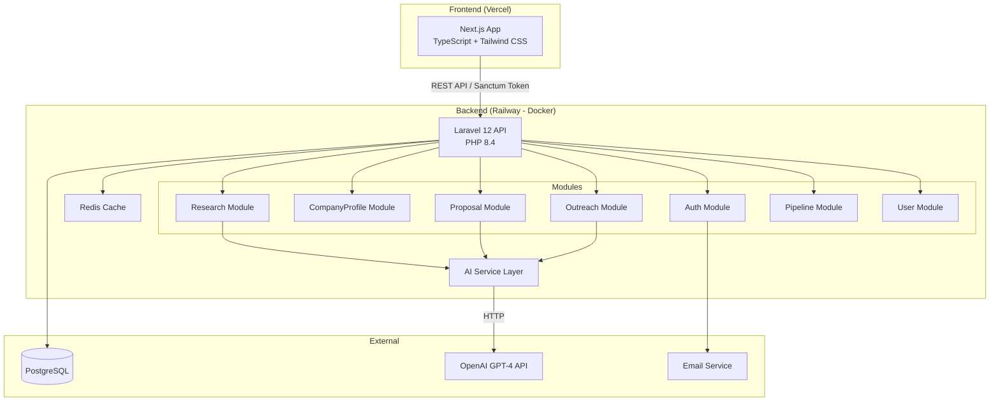
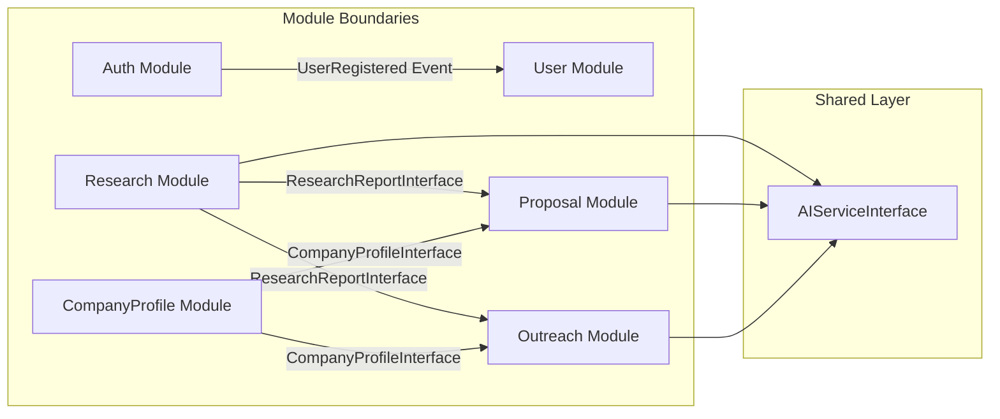
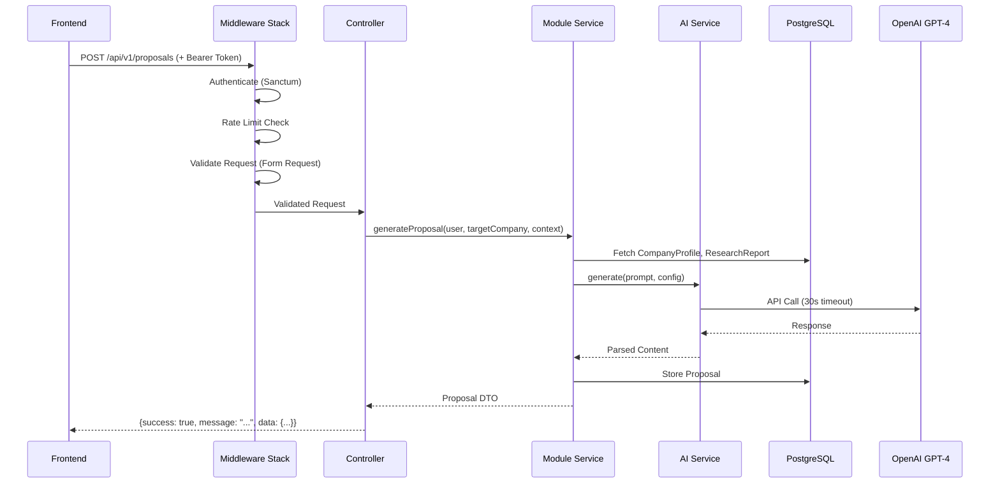
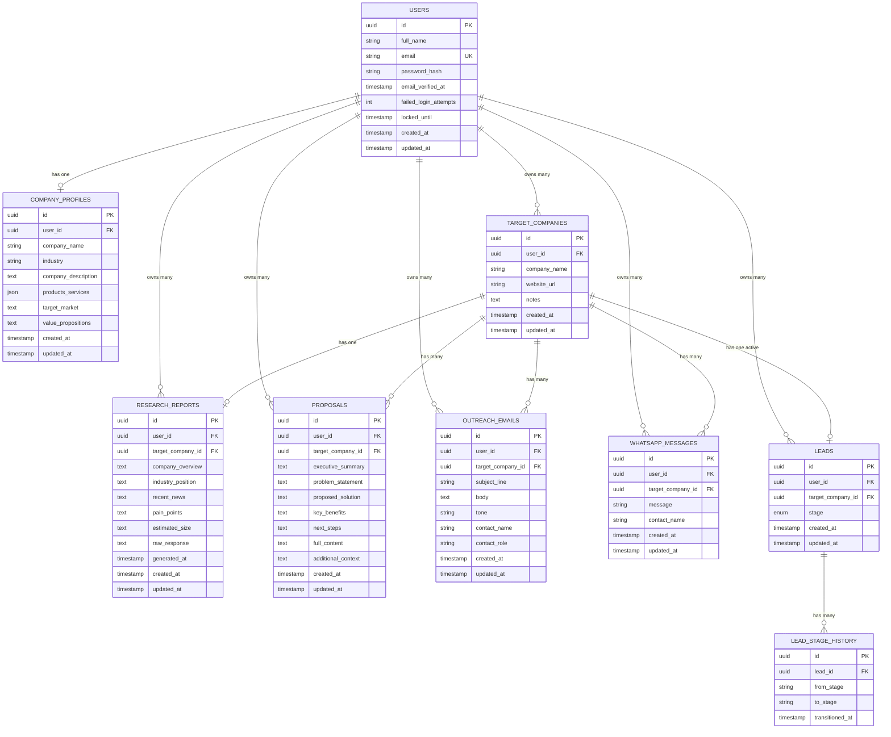

# Design Document: SalesPilot MVP

## Overview

SalesPilot MVP is a full-stack SaaS application that enables sales professionals to generate AI-powered sales content. The system follows a clear separation: a Next.js frontend (TypeScript, Tailwind CSS) communicates with a Laravel 12 backend (PHP 8.4) through a RESTful API. The backend is organized into 7 domain modules, each encapsulating its own routes, controllers, services, and models. AI content generation is powered by OpenAI GPT-4 through a shared AI service layer.

The architecture prioritizes:
- **User data isolation** via automatic query scoping
- **Modularity** for future extension (billing, analytics, enterprise)
- **Consistent API contracts** with standardized JSON responses
- **AI service reusability** across Research, Proposal, and Outreach modules



## Architecture

### System Architecture

The system uses a decoupled frontend/backend architecture with token-based authentication:

1. **Frontend Layer**: Next.js with App Router, server-side rendering for initial page loads, client-side navigation for SPA behavior. Communicates exclusively through the Backend API.

2. **API Gateway Layer**: Laravel routing with middleware stack handling authentication (Sanctum), rate limiting (60 req/min/user), and request validation (Form Requests).

3. **Module Layer**: Seven domain modules, each self-contained with its own service provider, routes, controllers, services, models, and form requests.

4. **Shared Services Layer**: Cross-cutting concerns including the AI Service (OpenAI integration), caching (Redis), and event dispatching.

5. **Data Layer**: PostgreSQL with UUID primary keys, automatic timestamps, proper indexing, and cascading foreign keys.

### Module Communication

Modules communicate through:
- **Service Interfaces**: Defined contracts (PHP interfaces) in each module, bound via service container
- **Events**: Laravel events for cross-module notifications (e.g., user deletion triggers cleanup)
- **Never** through direct model access across module boundaries



### Request Flow



## Components and Interfaces

### Backend Module Structure

Each module follows this directory structure:
```
app/Modules/{ModuleName}/
├── Controllers/
├── Services/
│   ├── Interfaces/
│   └── {ServiceName}Service.php
├── Models/
├── Requests/          (Form Requests)
├── Events/
├── Providers/
│   └── {ModuleName}ServiceProvider.php
└── routes.php
```

### Core Interfaces

#### AIServiceInterface

```php
interface AIServiceInterface
{
    /**
     * Generate content using OpenAI GPT-4.
     *
     * @param string $systemPrompt The system-level instructions
     * @param string $userPrompt The user-level content/context
     * @param array $options Additional config (temperature, max_tokens, etc.)
     * @return AIResponse
     * @throws AIServiceException
     */
    public function generate(string $systemPrompt, string $userPrompt, array $options = []): AIResponse;
}
```

#### CompanyProfileServiceInterface

```php
interface CompanyProfileServiceInterface
{
    public function getByUser(string $userId): ?CompanyProfile;
    public function createOrUpdate(string $userId, array $data): CompanyProfile;
    public function isComplete(string $userId): bool;
}
```

#### ResearchServiceInterface

```php
interface ResearchServiceInterface
{
    public function generateReport(string $userId, string $targetCompanyId, ?string $websiteUrl = null): ResearchReport;
    public function getReport(string $userId, string $targetCompanyId): ?ResearchReport;
    public function regenerateReport(string $userId, string $targetCompanyId, ?string $websiteUrl = null): ResearchReport;
}
```

#### ProposalServiceInterface

```php
interface ProposalServiceInterface
{
    public function generate(string $userId, string $targetCompanyId, ?string $additionalContext = null): Proposal;
    public function getByTargetCompany(string $userId, string $targetCompanyId): Collection;
    public function regenerate(string $userId, string $targetCompanyId, ?string $additionalContext = null): Proposal;
}
```

#### OutreachServiceInterface

```php
interface OutreachServiceInterface
{
    public function generateEmail(string $userId, string $targetCompanyId, array $options): OutreachEmail;
    public function generateWhatsApp(string $userId, string $targetCompanyId, array $options): WhatsAppMessage;
    public function getEmails(string $userId, string $targetCompanyId): Collection;
    public function getWhatsAppMessages(string $userId, string $targetCompanyId): Collection;
}
```

#### PipelineServiceInterface

```php
interface PipelineServiceInterface
{
    public function createLead(string $userId, string $targetCompanyId): Lead;
    public function moveStage(string $userId, string $leadId, string $newStage): Lead;
    public function deleteLead(string $userId, string $leadId): void;
    public function getLeads(string $userId, ?string $stage = null, ?string $search = null): Collection;
    public function getLeadWithHistory(string $userId, string $leadId): Lead;
}
```

### Frontend Component Architecture

```
src/
├── app/                    (Next.js App Router pages)
│   ├── (auth)/             (Login, Register, Reset)
│   ├── dashboard/
│   ├── company-profile/
│   ├── target-companies/
│   │   └── [id]/
│   ├── pipeline/
│   └── layout.tsx
├── components/
│   ├── ui/                 (Button, Input, Card, Toast, Modal, etc.)
│   ├── layout/             (Sidebar, Header, MobileMenu)
│   ├── dashboard/          (StatCards, RecentLeads, QuickActions)
│   ├── pipeline/           (PipelineBoard, LeadCard, StageColumn)
│   ├── research/           (ResearchForm, ResearchReport)
│   ├── proposals/          (ProposalCard, ProposalGenerator)
│   ├── outreach/           (EmailGenerator, WhatsAppGenerator)
│   └── company-profile/    (ProfileForm, ProductList)
├── hooks/                  (useAuth, useApi, useToast, etc.)
├── lib/
│   ├── api.ts              (API client with interceptors)
│   ├── auth.ts             (Token management)
│   └── utils.ts
├── types/                  (TypeScript interfaces)
└── styles/
    └── globals.css         (Tailwind directives + custom tokens)
```

### API Client

The frontend uses a centralized API client with:
- Automatic token injection from localStorage/cookie
- Response interceptor for 401 → redirect to login
- Request/response typing via generics
- Error normalization matching backend format

```typescript
interface ApiResponse<T> {
  success: boolean;
  message: string;
  data: T;
}

interface ApiError {
  success: false;
  message: string;
  errors: Record<string, string[]> | null;
}
```

### Standardized API Response Format

All endpoints return:

**Success:**
```json
{
  "success": true,
  "message": "Resource created successfully",
  "data": { ... }
}
```

**Error:**
```json
{
  "success": false,
  "message": "Validation failed",
  "errors": {
    "email": ["The email field is required."],
    "password": ["The password must be at least 8 characters."]
  }
}
```

## Data Models

### Entity Relationship Diagram



### Database Schema Details

**Users Table:**
- `id`: UUID, primary key
- `full_name`: VARCHAR(100), not null
- `email`: VARCHAR(255), unique, not null
- `password`: VARCHAR(255), bcrypt hashed (cost 12)
- `email_verified_at`: TIMESTAMP, nullable
- `failed_login_attempts`: INTEGER, default 0
- `locked_until`: TIMESTAMP, nullable
- `created_at`, `updated_at`: TIMESTAMPS

**Company Profiles Table:**
- `id`: UUID, primary key
- `user_id`: UUID, foreign key → users(id) ON DELETE CASCADE, unique (one per user)
- `company_name`: VARCHAR(255), not null
- `industry`: VARCHAR(255), not null
- `company_description`: TEXT, not null
- `products_services`: JSONB (array of {name: string, description: string})
- `target_market`: TEXT, nullable
- `value_propositions`: TEXT, nullable
- Indexed on: `user_id`

**Target Companies Table:**
- `id`: UUID, primary key
- `user_id`: UUID, foreign key → users(id) ON DELETE CASCADE
- `company_name`: VARCHAR(200), not null
- `website_url`: VARCHAR(500), nullable
- `notes`: TEXT, nullable
- Unique constraint: (`user_id`, `company_name`)
- Indexed on: `user_id`

**Research Reports Table:**
- `id`: UUID, primary key
- `user_id`: UUID, foreign key → users(id) ON DELETE CASCADE
- `target_company_id`: UUID, foreign key → target_companies(id) ON DELETE CASCADE
- `company_overview`, `industry_position`, `recent_news`, `pain_points`, `estimated_size`: TEXT
- `raw_response`: TEXT (full GPT-4 response for debugging)
- `generated_at`: TIMESTAMP
- Indexed on: `user_id`, `target_company_id`

**Proposals Table:**
- `id`: UUID, primary key
- `user_id`: UUID, foreign key → users(id) ON DELETE CASCADE
- `target_company_id`: UUID, foreign key → target_companies(id) ON DELETE CASCADE
- `executive_summary`, `problem_statement`, `proposed_solution`, `key_benefits`, `next_steps`: TEXT
- `full_content`: TEXT (combined formatted proposal)
- `additional_context`: TEXT, nullable (user-provided notes, max 2000 chars)
- Indexed on: `user_id`, `target_company_id`

**Outreach Emails Table:**
- `id`: UUID, primary key
- `user_id`: UUID, foreign key → users(id) ON DELETE CASCADE
- `target_company_id`: UUID, foreign key → target_companies(id) ON DELETE CASCADE
- `subject_line`: VARCHAR(100), not null
- `body`: TEXT, not null
- `tone`: VARCHAR(20), not null (enum: formal, friendly, direct)
- `contact_name`: VARCHAR(100), nullable
- `contact_role`: VARCHAR(100), nullable
- Indexed on: `user_id`, `target_company_id`

**WhatsApp Messages Table:**
- `id`: UUID, primary key
- `user_id`: UUID, foreign key → users(id) ON DELETE CASCADE
- `target_company_id`: UUID, foreign key → target_companies(id) ON DELETE CASCADE
- `message`: VARCHAR(500), not null
- `contact_name`: VARCHAR(100), nullable
- Indexed on: `user_id`, `target_company_id`

**Leads Table:**
- `id`: UUID, primary key
- `user_id`: UUID, foreign key → users(id) ON DELETE CASCADE
- `target_company_id`: UUID, foreign key → target_companies(id) ON DELETE CASCADE
- `stage`: VARCHAR(20), CHECK constraint (prospect, proposal_sent, won, lost)
- Unique constraint: (`user_id`, `target_company_id`) to prevent duplicate active leads
- Indexed on: `user_id`, `target_company_id`, `stage`

**Lead Stage History Table:**
- `id`: UUID, primary key
- `lead_id`: UUID, foreign key → leads(id) ON DELETE CASCADE
- `from_stage`: VARCHAR(20), nullable (null for initial creation)
- `to_stage`: VARCHAR(20), not null
- `transitioned_at`: TIMESTAMP, not null
- Indexed on: `lead_id`

### Caching Strategy (Redis)

- **Rate limiting**: Sliding window counters per user (key: `rate_limit:{user_id}`)
- **Login lockout**: Failed attempt counts and lock timestamps (key: `login_lockout:{email}`)
- **Dashboard stats**: Cached for 5 minutes per user (key: `dashboard:{user_id}`)
- **Session tokens**: Sanctum token validation cache

## Correctness Properties

*A property is a characteristic or behavior that should hold true across all valid executions of a system—essentially, a formal statement about what the system should do. Properties serve as the bridge between human-readable specifications and machine-verifiable correctness guarantees.*

### Property 1: Password Validation Correctness

*For any* string, the password validator SHALL accept it if and only if it has length between 8 and 128 characters inclusive AND contains at least one uppercase letter, one lowercase letter, and one number.

**Validates: Requirements 1.5, 1.7**

### Property 2: Duplicate Email Rejection

*For any* existing user email in the system, attempting to register a new account with the same email SHALL be rejected with an appropriate error.

**Validates: Requirements 1.3**

### Property 3: Generic Authentication Error

*For any* invalid credential combination (wrong email, wrong password, or both), the login response SHALL return the same generic error message without revealing which field was incorrect.

**Validates: Requirements 2.2**

### Property 4: Account Lockout After Failed Attempts

*For any* user account, if 5 consecutive failed login attempts occur within 5 minutes, the account SHALL be locked for 15 minutes, and any subsequent login attempt during lockout SHALL be rejected with the remaining lockout duration.

**Validates: Requirements 2.6, 2.7**

### Property 5: Unverified Email Login Rejection

*For any* user with an unverified email who provides valid credentials, the login attempt SHALL be rejected with a message indicating email verification is required.

**Validates: Requirements 2.8**

### Property 6: Password Reset Invalidates All Sessions

*For any* user who successfully resets their password, all previously issued session tokens SHALL be invalidated.

**Validates: Requirements 3.2**

### Property 7: Anti-Enumeration Response Consistency

*For any* email submitted to the password reset endpoint (whether it exists in the system or not), the response structure and message SHALL be identical.

**Validates: Requirements 3.4**

### Property 8: Company Profile Round-Trip

*For any* valid company profile data, saving the profile and then retrieving it SHALL return data identical to what was saved. Subsequently saving different valid data SHALL overwrite the previous profile completely.

**Validates: Requirements 4.2, 4.3, 4.4**

### Property 9: Company Profile Required Field Validation

*For any* company profile submission missing one or more required fields (company name, industry, company description, or at least one product/service), the submission SHALL be rejected with field-specific error messages.

**Validates: Requirements 4.5**

### Property 10: Research Prompt Construction

*For any* target company with a name (2-200 chars) and optional website URL, the AI prompt sent to GPT-4 SHALL include the company name, and SHALL include the website URL if and only if one was provided.

**Validates: Requirements 5.2, 5.7**

### Property 11: Research Report Storage Round-Trip

*For any* successfully generated research report, storing it and then retrieving it SHALL return all report sections (company overview, industry position, recent news, pain points, estimated size) with the generation date.

**Validates: Requirements 5.3, 5.5**

### Property 12: Research Regeneration Replaces Previous

*For any* target company with an existing research report, regenerating the report SHALL replace the previous report with the new one (only one report per target company exists).

**Validates: Requirements 5.6**

### Property 13: Target Company Name Length Validation

*For any* string submitted as a target company name, the system SHALL accept it if and only if its length is between 2 and 200 characters inclusive.

**Validates: Requirements 5.8**

### Property 14: Content Generation Requires Complete Profile

*For any* user without a completed company profile, ALL content generation requests (proposals, outreach emails, WhatsApp messages) SHALL be blocked with a message directing the user to complete their profile.

**Validates: Requirements 6.5, 7.7, 8.8**

### Property 15: Content Generation Requires Research Report

*For any* target company without a research report, ALL content generation requests (proposals, outreach emails, WhatsApp messages) for that company SHALL be blocked with a message directing the user to run research first.

**Validates: Requirements 6.6, 7.8, 8.9**

### Property 16: Proposal Contains Required Sections

*For any* successfully generated proposal, it SHALL contain all five sections: executive summary, problem statement, proposed solution, key benefits, and next steps.

**Validates: Requirements 6.2**

### Property 17: Content Versioning Is Additive

*For any* target company, generating a new proposal, outreach email, or WhatsApp message SHALL add a new record without removing or modifying any previously generated content for that company. All versions SHALL be retrievable ordered by creation date descending.

**Validates: Requirements 6.8, 7.6, 8.7, 6.10**

### Property 18: Outreach Email Structure

*For any* successfully generated outreach email, the subject line SHALL be no more than 100 characters, and the email SHALL contain a greeting, body, value proposition paragraph, and a call-to-action.

**Validates: Requirements 7.2**

### Property 19: WhatsApp Message Length Constraint

*For any* successfully generated WhatsApp message, the message length SHALL be no more than 500 characters.

**Validates: Requirements 8.2**

### Property 20: Lead Default Stage

*For any* newly created lead, its initial stage SHALL be "prospect" regardless of other input parameters.

**Validates: Requirements 9.2**

### Property 21: Stage Transition Records History

*For any* lead stage transition, the system SHALL update the lead's stage to the new value AND record a history entry with the from_stage, to_stage, and transition timestamp.

**Validates: Requirements 9.3**

### Property 22: Leads Ordered By Most Recently Updated

*For any* set of leads within a pipeline stage, they SHALL be ordered by most recently updated first.

**Validates: Requirements 9.4**

### Property 23: Unrestricted Stage Movement

*For any* lead in any stage (prospect, proposal_sent, won, lost), moving it to any other valid stage SHALL succeed.

**Validates: Requirements 9.5**

### Property 24: Lead Deletion Retains Target Company Content

*For any* lead that is deleted, the associated target company and all its generated content (research reports, proposals, emails, WhatsApp messages) SHALL remain accessible.

**Validates: Requirements 9.7**

### Property 25: Pipeline Search Correctness

*For any* search query string, the pipeline search SHALL return all and only those leads whose target company name contains the query as a case-insensitive substring.

**Validates: Requirements 9.8**

### Property 26: Duplicate Lead Rejection

*For any* target company that already has an active lead in a user's pipeline, attempting to create another lead for that same target company SHALL be rejected.

**Validates: Requirements 9.9**

### Property 27: Target Company Edit Round-Trip

*For any* target company, updating its name, website URL, or notes and then retrieving it SHALL return the updated values.

**Validates: Requirements 10.3**

### Property 28: Target Company Cascading Deletion

*For any* target company that is deleted, ALL associated records (leads, research reports, proposals, outreach emails, WhatsApp messages) SHALL also be removed.

**Validates: Requirements 10.5**

### Property 29: Duplicate Target Company Name Rejection Per User

*For any* user who already has a target company with a given name, attempting to create another target company with the same name SHALL be rejected. Different users SHALL be able to use the same company name.

**Validates: Requirements 10.6**

### Property 30: Dashboard Counts Accuracy

*For any* user's data state, the dashboard counts SHALL accurately reflect: total leads per pipeline stage, total target companies, proposals generated this month, and outreach emails generated this month.

**Validates: Requirements 12.1**

### Property 31: Dashboard Recent Leads Ordering

*For any* user with more than 5 leads, the dashboard SHALL return exactly the 5 most recently updated leads, ordered by most recently updated first.

**Validates: Requirements 12.2**

### Property 32: Standardized API Success Response Format

*For any* successful API request, the response SHALL contain a boolean "success" field set to true, a string "message" field, and a "data" field containing the response payload.

**Validates: Requirements 13.2**

### Property 33: Standardized API Error Response Format

*For any* failed API request, the response SHALL contain a boolean "success" field set to false, a string "message" field, and a nullable "errors" field for field-level validation details.

**Validates: Requirements 13.3**

### Property 34: Rate Limiting Enforcement

*For any* authenticated user who exceeds 60 requests per minute, subsequent requests within that minute SHALL receive an HTTP 429 response with a Retry-After header.

**Validates: Requirements 13.6**

### Property 35: Authentication Required for Protected Endpoints

*For any* request to a protected API endpoint without a valid Sanctum token, the system SHALL return an HTTP 401 response.

**Validates: Requirements 13.7, 13.9**

### Property 36: User Data Isolation

*For any* two distinct users A and B, user A SHALL NOT be able to access, modify, or delete any resource (company profiles, target companies, leads, research reports, proposals, outreach emails, WhatsApp messages) belonging to user B. Attempting such access SHALL return HTTP 403.

**Validates: Requirements 14.1, 14.2**

### Property 37: Account Deletion Cascades All Data

*For any* user who deletes their account, ALL associated data (company profile, target companies, leads, research reports, proposals, outreach emails, WhatsApp messages, and lead stage history) SHALL be permanently removed.

**Validates: Requirements 14.4, 16.3**

### Property 38: UUID Primary Keys

*For any* record created in any table, its primary key SHALL be a valid UUID v4 format.

**Validates: Requirements 16.1**

### Property 39: Stage Enum Constraint

*For any* attempt to set a lead's stage to a value outside {prospect, proposal_sent, won, lost}, the system SHALL reject the operation.

**Validates: Requirements 16.6**

## Error Handling

### Error Handling Strategy

The system implements a layered error handling approach:

#### Backend Error Layers

1. **Validation Layer** (Form Requests)
   - All incoming data validated before reaching controllers
   - Returns HTTP 422 with field-level error details
   - Each module defines its own Form Request classes

2. **Business Logic Layer** (Services)
   - Domain-specific exceptions (e.g., `CompanyProfileIncompleteException`, `ResearchNotFoundException`)
   - Services throw typed exceptions that controllers catch and map to appropriate HTTP responses
   - Pre-condition checks (profile complete, research exists) handled at service layer

3. **AI Service Layer**
   - 30-second timeout on all OpenAI API calls
   - Wraps API errors in `AIServiceException` with user-friendly messages
   - Logs full error details including request/response for debugging
   - Returns standardized error format to calling modules

4. **Infrastructure Layer**
   - Rate limiting: HTTP 429 with Retry-After header
   - Authentication: HTTP 401 for missing/expired tokens
   - Authorization: HTTP 403 for cross-user resource access
   - Not Found: HTTP 404 with descriptive message

5. **Global Exception Handler**
   - Catches all unhandled exceptions
   - Production: Returns generic HTTP 500 with "Internal server error" message
   - Development: Returns full exception details for debugging
   - All exceptions logged with stack trace, request context, and user ID

#### Frontend Error Handling

1. **API Client Interceptors**
   - 401 → Clear token, redirect to login
   - 422 → Extract field errors, pass to form components
   - 429 → Show rate limit toast with retry countdown
   - 500 → Show generic error toast
   - Network errors → Show connectivity error with retry option

2. **Form Error Display**
   - Field-level errors displayed below each input via `aria-describedby`
   - Form-level errors displayed in an alert component above the form
   - Errors cleared on field change

3. **AI Generation Errors**
   - Timeout (30s) → Re-enable generation button + show timeout message
   - API failure → Show retry suggestion toast
   - No duplicate generation during pending requests (button disabled)

4. **Optimistic UI Rollback**
   - Pipeline drag-and-drop: Optimistic stage update, rollback on API failure
   - Toast notification on rollback with error details

### Error Response Mapping

| Scenario | HTTP Code | Message Pattern |
|----------|-----------|----------------|
| Validation failure | 422 | "Validation failed" + field errors |
| Invalid credentials | 401 | "Invalid credentials" (generic) |
| Token expired | 401 | "Unauthenticated" |
| Account locked | 423 | "Account locked. Try again in X minutes" |
| Forbidden resource | 403 | "You do not have access to this resource" |
| Resource not found | 404 | "{Resource} not found" |
| Rate limited | 429 | "Too many requests" + Retry-After |
| AI timeout | 504 | "AI service timed out. Please retry" |
| AI error | 502 | "AI service unavailable. Please retry" |
| Profile incomplete | 422 | "Complete your company profile first" |
| Research missing | 422 | "Run company research first" |
| Server error | 500 | "Internal server error" |

## Testing Strategy

### Testing Approach

The project uses a dual testing approach combining unit/example-based tests with property-based tests for comprehensive coverage.

### Backend Testing (PHPUnit + Pest)

**Unit Tests:**
- Service layer logic (mocked dependencies)
- Form Request validation rules
- Model relationships and scopes
- AI prompt construction
- Response parsing/formatting

**Integration Tests:**
- Full API endpoint tests with database
- Authentication flows (register, login, reset)
- CRUD operations for all modules
- Cascading deletion verification
- User data isolation enforcement

**Property-Based Testing Library: Pest + custom generators (or PHPUnit with eris/php-quickcheck)**

Property tests SHALL:
- Run minimum 100 iterations per property
- Reference the design document property in a tag comment
- Tag format: `Feature: salespilot-mvp, Property {number}: {property_text}`
- Use data generators for: emails, names, passwords, company names, UUIDs, stage enums

**Key property test generators:**
- `validPassword()`: Generates strings 8-128 chars with uppercase, lowercase, number
- `invalidPassword()`: Generates strings violating at least one password rule
- `companyName()`: Generates strings 2-200 chars
- `targetCompanyData()`: Generates valid target company records
- `pipelineStage()`: Generates one of {prospect, proposal_sent, won, lost}
- `companyProfileData()`: Generates valid profile structures with products array

### Frontend Testing (Vitest + React Testing Library)

**Unit Tests:**
- API client response handling
- Form validation logic
- State management (hooks)
- Utility functions

**Component Tests:**
- Form submissions and error display
- Loading states and skeleton screens
- Toast notification lifecycle
- Pipeline drag-and-drop behavior
- Responsive breakpoint behavior

**End-to-End Tests (Playwright):**
- Full registration → login → profile setup → research → proposal flow
- Pipeline management workflow
- Cross-device responsive testing at 320px, 768px, 1920px

### Test Coverage Targets

- Backend unit/integration: 80%+ line coverage
- Backend property tests: All 39 correctness properties covered
- Frontend component tests: All interactive components
- E2E: Critical user flows (auth, content generation, pipeline)

### CI/CD Integration

- Tests run on every PR against main
- Property tests run in CI with 100 iterations (configurable up to 1000 for release)
- Failed property tests report the shrunk counterexample
- E2E tests run against a staging environment

