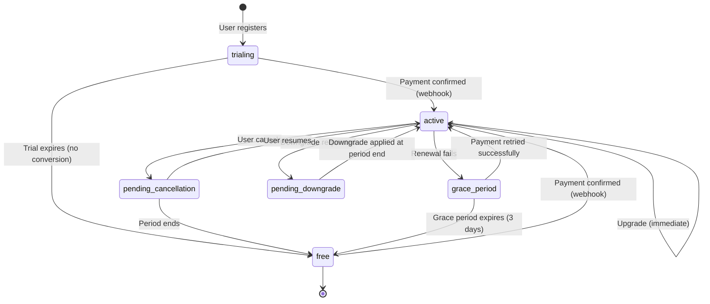
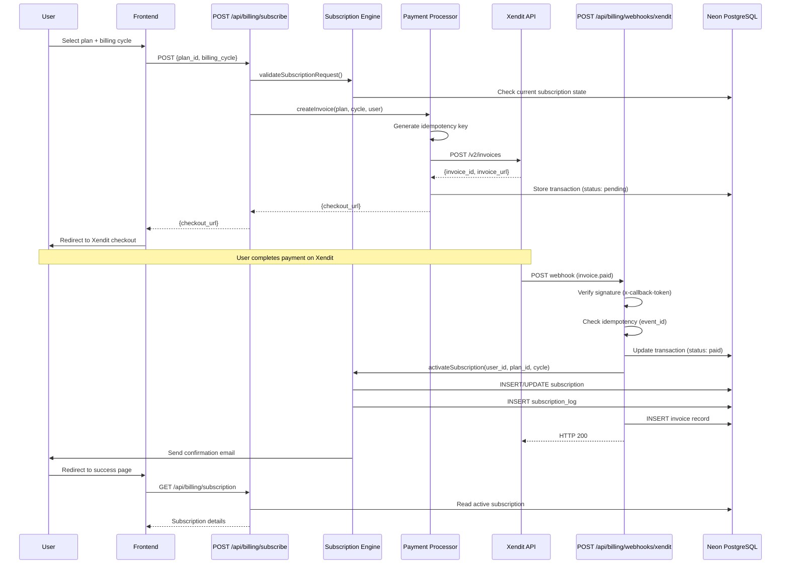
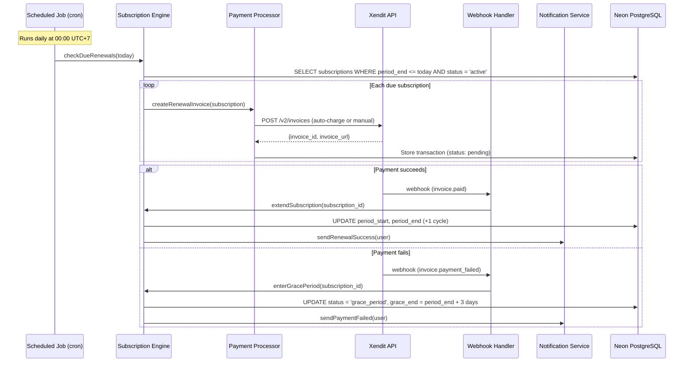

# Design Document: Subscription & Billing System

## Overview

The Subscription & Billing System monetizes SalesPilot AI through a four-tier SaaS model (Free, Starter, Professional, Business) with Xendit as the Indonesian payment gateway. The system manages the complete subscription lifecycle — creation, upgrades, downgrades, cancellations, renewals, and trials — while enforcing per-plan usage limits and providing billing transparency through user and admin dashboards.

### Core Design Philosophy

The system is decomposed into **6 domain modules**, each owning a distinct responsibility:

1. **Plan Catalog** — Static plan definitions, pricing, feature limits
2. **Subscription Engine** — State machine for subscription lifecycle transitions
3. **Payment Processor** — Xendit invoice creation, checkout flow orchestration
4. **Webhook Handler** — Secure async payment verification, idempotent event processing
5. **Usage Tracker** — Per-plan limit enforcement, counter management, cycle resets
6. **Notification Service** — Transactional email dispatch for billing events

### Key Architectural Decisions

| Decision | Rationale |
|----------|-----------|
| Xendit Invoice API (not subscriptions API) | Gives full control over billing logic; Xendit handles only payment collection |
| Server-side webhook as source of truth | Prevents frontend tampering; subscription activates only on verified webhook |
| Subscription state machine pattern | Explicit states and transitions prevent invalid states; all transitions logged |
| Raw SQL via neon() tagged templates | Consistent with existing codebase; no ORM overhead; full control over queries |
| Proration calculated server-side | Ensures billing accuracy; formula is deterministic and testable |
| Usage counters in dedicated table | Enables atomic increment/check and independent reset from subscription logic |
| JWT auth on all billing routes | Leverages existing auth-server.ts; no new auth system needed |

## Architecture

### High-Level Module Boundaries

```mermaid
graph TB
    subgraph Frontend["Presentation Layer"]
        PP[Pricing Page]
        BD[Billing Dashboard]
        AD[Admin Revenue Dashboard]
        UM[Upgrade Modal]
    end

    subgraph API["API Routes (app/api/billing/)"]
        PC[/plans]
        SC[/subscribe]
        WH[/webhooks/xendit]
        SM[/subscription]
        US[/usage]
        TX[/transactions]
        AR[/admin/revenue]
    end

    subgraph Modules["Domain Modules (lib/billing/)"]
        CAT[Plan Catalog]
        SE[Subscription Engine]
        PAY[Payment Processor]
        WHM[Webhook Handler]
        UT[Usage Tracker]
        NS[Notification Service]
    end

    subgraph External["External Services"]
        XEN[Xendit API]
        EMAIL[Email Provider]
        DB[(Neon PostgreSQL)]
    end

    PP --> PC
    BD --> SM & US & TX
    AD --> AR
    UM --> SC

    PC --> CAT
    SC --> PAY
    WH --> WHM
    SM --> SE
    US --> UT
    AR --> SE & UT

    PAY --> XEN
    WHM --> SE
    SE --> DB
    UT --> DB
    NS --> EMAIL
    WHM --> NS
    SE --> NS
```

### Subscription State Machine



**Valid States:**
- `trialing` — 7-day trial with Professional features, no payment required
- `active` — Paid subscription, features unlocked per plan
- `pending_cancellation` — Active until period_end, then transitions to free
- `pending_downgrade` — Active on current plan until period_end, then switches to lower plan
- `grace_period` — Renewal failed, 3-day window to retry payment
- `free` — Free tier with basic limits

### Xendit Payment Flow



### Renewal Flow



## Components and Interfaces

### Module 1: Plan Catalog

Static plan configuration with pricing and feature limits.

```typescript
// lib/billing/plan-catalog.ts

export interface PlanDefinition {
  id: string;              // 'free' | 'starter' | 'professional' | 'business'
  name: string;
  monthlyPrice: number;   // in IDR (Rp)
  yearlyPrice: number;    // in IDR (Rp), 20% discount applied
  features: PlanFeatures;
  isRecommended: boolean;
  displayOrder: number;
}

export interface PlanFeatures {
  prospectDiscoveryLimit: number;  // -1 = unlimited
  exportLimit: number;             // -1 = unlimited
  aiCreditsLimit: number;          // -1 = unlimited
  hasAdvancedAI: boolean;
  hasWhatsAppIntegration: boolean;
  hasPrioritySupport: boolean;
  hasCustomBranding: boolean;
  hasApiAccess: boolean;
  supportLevel: 'community' | 'email' | 'priority' | 'dedicated';
}

export interface PlanCatalog {
  getAllPlans(): PlanDefinition[];
  getPlanById(planId: string): PlanDefinition | null;
  getPriceForCycle(planId: string, cycle: 'monthly' | 'yearly'): number;
  getRecommendedPlan(): PlanDefinition;
}
```

### Module 2: Subscription Engine

Manages state transitions and enforces business rules.

```typescript
// lib/billing/subscription-engine.ts

export type SubscriptionStatus =
  | 'trialing'
  | 'active'
  | 'pending_cancellation'
  | 'pending_downgrade'
  | 'grace_period'
  | 'free';

export interface Subscription {
  id: string;
  userId: string;
  planId: string;
  status: SubscriptionStatus;
  billingCycle: 'monthly' | 'yearly';
  currentPeriodStart: Date;
  currentPeriodEnd: Date;
  trialEnd: Date | null;
  cancelledAt: Date | null;
  downgradeToplanId: string | null;
  gracePeriodEnd: Date | null;
  createdAt: Date;
  updatedAt: Date;
}

export interface ProrationResult {
  daysRemaining: number;
  totalDaysInCycle: number;
  creditAmount: number;   // IDR credit from current plan
  chargeAmount: number;   // IDR charge for new plan (prorated)
  netAmount: number;      // chargeAmount - creditAmount
}

export interface SubscriptionEngine {
  // State queries
  getSubscription(userId: string): Promise<Subscription | null>;
  getEffectivePlan(userId: string): Promise<PlanDefinition>;

  // State transitions
  createTrial(userId: string): Promise<Subscription>;
  activateSubscription(userId: string, planId: string, cycle: 'monthly' | 'yearly'): Promise<Subscription>;
  upgradePlan(userId: string, newPlanId: string): Promise<ProrationResult>;
  downgradePlan(userId: string, newPlanId: string): Promise<Subscription>;
  cancelSubscription(userId: string): Promise<Subscription>;
  resumeSubscription(userId: string): Promise<Subscription>;
  extendPeriod(subscriptionId: string): Promise<Subscription>;
  enterGracePeriod(subscriptionId: string): Promise<Subscription>;
  expireToFree(subscriptionId: string): Promise<Subscription>;
  changeBillingCycle(userId: string, newCycle: 'monthly' | 'yearly'): Promise<ProrationResult | null>;

  // Proration
  calculateProration(currentPlan: PlanDefinition, newPlan: PlanDefinition, 
    cycle: 'monthly' | 'yearly', periodStart: Date, periodEnd: Date): ProrationResult;
}
```

### Module 3: Payment Processor

Interfaces with Xendit Invoice API for payment collection.

```typescript
// lib/billing/payment-processor.ts

export interface XenditInvoiceRequest {
  external_id: string;          // Our transaction ID
  amount: number;               // IDR amount
  payer_email: string;
  description: string;
  invoice_duration: number;     // seconds until expiry (86400 = 24h)
  success_redirect_url: string;
  failure_redirect_url: string;
  payment_methods: string[];    // ['BANK_TRANSFER', 'EWALLET', 'QR_CODE', 'CREDIT_CARD', 'RETAIL_OUTLET', 'DIRECT_DEBIT']
  currency: 'IDR';
  metadata: {
    user_id: string;
    plan_id: string;
    billing_cycle: string;
    subscription_id?: string;
    type: 'new' | 'renewal' | 'upgrade';
  };
}

export interface XenditInvoiceResponse {
  id: string;                   // Xendit invoice ID
  external_id: string;
  invoice_url: string;          // Checkout URL for redirect
  status: string;
  amount: number;
  expiry_date: string;
}

export interface PaymentProcessor {
  createCheckoutInvoice(params: {
    userId: string;
    planId: string;
    billingCycle: 'monthly' | 'yearly';
    amount: number;
    type: 'new' | 'renewal' | 'upgrade';
    subscriptionId?: string;
  }): Promise<{ checkoutUrl: string; transactionId: string }>;

  generateIdempotencyKey(userId: string, planId: string, timestamp: number): string;
}
```

### Module 4: Webhook Handler

Secure, idempotent webhook processing for Xendit callbacks.

```typescript
// lib/billing/webhook-handler.ts

export interface WebhookEvent {
  id: string;                   // Xendit event ID
  event: 'invoice.paid' | 'invoice.expired' | 'invoice.payment_failed';
  data: {
    id: string;                 // Invoice ID
    external_id: string;        // Our transaction ID
    amount: number;
    status: string;
    paid_at?: string;
    payment_method?: string;
    payment_channel?: string;
    metadata: {
      user_id: string;
      plan_id: string;
      billing_cycle: string;
      subscription_id?: string;
      type: string;
    };
  };
}

export interface WebhookProcessingResult {
  success: boolean;
  eventId: string;
  action: 'activated' | 'renewed' | 'upgraded' | 'failed' | 'expired' | 'duplicate';
  message: string;
}

export interface WebhookHandler {
  verifySignature(callbackToken: string, expectedToken: string): boolean;
  isAlreadyProcessed(eventId: string): Promise<boolean>;
  processEvent(event: WebhookEvent): Promise<WebhookProcessingResult>;
  logEvent(event: WebhookEvent, result: WebhookProcessingResult): Promise<void>;
}
```

### Module 5: Usage Tracker

Tracks and enforces per-plan feature usage limits.

```typescript
// lib/billing/usage-tracker.ts

export type UsageType = 'prospect_discovery' | 'export' | 'ai_credits';

export interface UsageRecord {
  userId: string;
  usageType: UsageType;
  currentCount: number;
  maxAllowed: number;        // -1 = unlimited
  cycleResetDate: Date;
}

export interface UsageCheckResult {
  allowed: boolean;
  currentCount: number;
  maxAllowed: number;
  remaining: number;         // -1 if unlimited
  cycleResetDate: Date;
}

export interface UsageTracker {
  checkUsage(userId: string, usageType: UsageType): Promise<UsageCheckResult>;
  incrementUsage(userId: string, usageType: UsageType, amount?: number): Promise<UsageCheckResult>;
  getUsageSummary(userId: string): Promise<UsageRecord[]>;
  resetCycleCounters(userId: string): Promise<void>;
  getUsageLimitForPlan(planId: string, usageType: UsageType): number;
}
```

### Module 6: Notification Service

Dispatches transactional emails for billing events.

```typescript
// lib/billing/notification-service.ts

export type BillingEmailType =
  | 'trial_started'
  | 'trial_expiring'
  | 'payment_success'
  | 'payment_failed'
  | 'renewal_reminder'
  | 'subscription_cancelled'
  | 'plan_changed'
  | 'welcome';

export interface EmailPayload {
  to: string;
  type: BillingEmailType;
  data: Record<string, unknown>;
}

export interface NotificationService {
  send(payload: EmailPayload): Promise<void>;
  scheduleReminder(userId: string, type: BillingEmailType, sendAt: Date, data: Record<string, unknown>): Promise<void>;
}
```

### API Route Design

All billing API routes live under `app/api/billing/`:

```
app/api/billing/
├── plans/route.ts              GET — list all plans with pricing
├── subscribe/route.ts          POST — create checkout session
├── subscription/route.ts       GET — current subscription status
│                               PATCH — upgrade/downgrade/cancel/resume/change-cycle
├── usage/route.ts              GET — usage summary for current user
├── transactions/route.ts       GET — payment history
├── invoices/[id]/pdf/route.ts  GET — download invoice PDF
├── webhooks/xendit/route.ts    POST — Xendit webhook receiver (no auth)
└── admin/
    └── revenue/route.ts        GET — admin revenue dashboard data
```

#### Route Patterns

```typescript
// app/api/billing/subscribe/route.ts
import { NextRequest } from 'next/server';
import { getUserIdFromRequest, unauthorized } from '@/lib/auth-server';
import { getDb } from '@/lib/db';

export async function POST(request: NextRequest) {
  const userId = getUserIdFromRequest(request);
  if (!userId) return unauthorized();

  // Rate limiting check (5 req/min per user)
  // Validate plan_id and billing_cycle
  // Create Xendit invoice via Payment Processor
  // Return checkout URL
}
```

```typescript
// app/api/billing/webhooks/xendit/route.ts
// NOTE: No JWT auth — authenticated via x-callback-token header

export async function POST(request: NextRequest) {
  const callbackToken = request.headers.get('x-callback-token');
  // Verify signature
  // Check idempotency
  // Process event
  // Return 200 immediately
}
```

### Frontend Component Architecture

```
frontend/
├── app/
│   ├── pricing/page.tsx                # Public pricing page
│   ├── billing/
│   │   ├── page.tsx                    # Billing dashboard (subscription + usage + history)
│   │   ├── success/page.tsx            # Post-payment success page
│   │   └── failed/page.tsx             # Post-payment failure page
│   └── admin/
│       └── revenue/page.tsx            # Admin revenue dashboard
├── components/
│   └── billing/
│       ├── PricingCard.tsx             # Individual plan card with features
│       ├── PricingToggle.tsx           # Monthly/Yearly toggle with savings
│       ├── SubscriptionStatus.tsx      # Current plan status banner
│       ├── UsageMeter.tsx              # Progress bar for usage limits
│       ├── PaymentHistory.tsx          # Transaction list table
│       ├── UpgradeModal.tsx            # Plan change confirmation dialog
│       ├── CancelModal.tsx             # Cancellation confirmation
│       ├── TrialBanner.tsx             # Trial countdown notification
│       └── RevenueChart.tsx            # Admin MRR/revenue line chart
└── lib/billing/
    ├── plan-catalog.ts                 # Plan definitions + helpers
    ├── subscription-engine.ts          # State machine + proration
    ├── payment-processor.ts            # Xendit API integration
    ├── webhook-handler.ts              # Webhook verification + processing
    ├── usage-tracker.ts                # Usage limit enforcement
    ├── notification-service.ts         # Email dispatch
    └── types.ts                        # Shared TypeScript types
```

#### PricingCard Component (Example)

```typescript
// components/billing/PricingCard.tsx
'use client';

import { motion } from 'framer-motion';
import { PlanDefinition } from '@/lib/billing/plan-catalog';
import { Button } from '@/components/ui/Button';

interface PricingCardProps {
  plan: PlanDefinition;
  billingCycle: 'monthly' | 'yearly';
  currentPlanId: string | null;
  onSelect: (planId: string) => void;
}

export function PricingCard({ plan, billingCycle, currentPlanId, onSelect }: PricingCardProps) {
  const price = billingCycle === 'monthly' ? plan.monthlyPrice : plan.yearlyPrice;
  const isCurrent = plan.id === currentPlanId;

  return (
    <motion.div
      initial={{ opacity: 0, y: 12 }}
      animate={{ opacity: 1, y: 0 }}
      className={`glass rounded-2xl p-6 relative ${plan.isRecommended ? 'border-[var(--accent)] ring-1 ring-[var(--accent)]' : ''}`}
    >
      {plan.isRecommended && (
        <span className="absolute -top-3 left-1/2 -translate-x-1/2 bg-[var(--accent)] text-white text-xs px-3 py-1 rounded-full">
          Most Popular
        </span>
      )}
      {/* Plan name, price, features, CTA button */}
    </motion.div>
  );
}
```

## Data Models

### Database Schema

#### Table 1: `plans`

```sql
CREATE TABLE IF NOT EXISTS plans (
  id VARCHAR(20) PRIMARY KEY,
  name VARCHAR(50) NOT NULL,
  monthly_price INTEGER NOT NULL DEFAULT 0,
  yearly_price INTEGER NOT NULL DEFAULT 0,
  features JSONB NOT NULL DEFAULT '{}',
  is_recommended BOOLEAN DEFAULT FALSE,
  display_order INTEGER NOT NULL DEFAULT 0,
  created_at TIMESTAMP DEFAULT NOW(),
  updated_at TIMESTAMP DEFAULT NOW()
);

-- Seed data
INSERT INTO plans (id, name, monthly_price, yearly_price, features, is_recommended, display_order) VALUES
('free', 'Free', 0, 0, '{"prospectDiscoveryLimit": 20, "exportLimit": 5, "aiCreditsLimit": 10, "hasAdvancedAI": false, "hasWhatsAppIntegration": false, "hasPrioritySupport": false, "hasCustomBranding": false, "hasApiAccess": false, "supportLevel": "community"}', false, 1),
('starter', 'Starter', 299000, 2870400, '{"prospectDiscoveryLimit": 200, "exportLimit": 50, "aiCreditsLimit": 100, "hasAdvancedAI": false, "hasWhatsAppIntegration": true, "hasPrioritySupport": false, "hasCustomBranding": false, "hasApiAccess": false, "supportLevel": "email"}', false, 2),
('professional', 'Professional', 799000, 7670400, '{"prospectDiscoveryLimit": 2000, "exportLimit": 500, "aiCreditsLimit": -1, "hasAdvancedAI": true, "hasWhatsAppIntegration": true, "hasPrioritySupport": true, "hasCustomBranding": false, "hasApiAccess": true, "supportLevel": "priority"}', true, 3),
('business', 'Business', 1999000, 19190400, '{"prospectDiscoveryLimit": -1, "exportLimit": -1, "aiCreditsLimit": -1, "hasAdvancedAI": true, "hasWhatsAppIntegration": true, "hasPrioritySupport": true, "hasCustomBranding": true, "hasApiAccess": true, "supportLevel": "dedicated"}', false, 4)
ON CONFLICT (id) DO NOTHING;
```

#### Table 2: `subscriptions`

```sql
CREATE TABLE IF NOT EXISTS subscriptions (
  id UUID PRIMARY KEY DEFAULT gen_random_uuid(),
  user_id UUID NOT NULL REFERENCES users(id) ON DELETE CASCADE,
  plan_id VARCHAR(20) NOT NULL REFERENCES plans(id),
  status VARCHAR(30) NOT NULL DEFAULT 'trialing',
  billing_cycle VARCHAR(10) NOT NULL DEFAULT 'monthly',
  current_period_start TIMESTAMP NOT NULL,
  current_period_end TIMESTAMP NOT NULL,
  trial_end TIMESTAMP,
  cancelled_at TIMESTAMP,
  downgrade_to_plan_id VARCHAR(20) REFERENCES plans(id),
  grace_period_end TIMESTAMP,
  created_at TIMESTAMP DEFAULT NOW(),
  updated_at TIMESTAMP DEFAULT NOW(),
  CONSTRAINT valid_status CHECK (status IN ('trialing', 'active', 'pending_cancellation', 'pending_downgrade', 'grace_period', 'free'))
);

CREATE UNIQUE INDEX IF NOT EXISTS idx_subscriptions_user_active
  ON subscriptions(user_id) WHERE status != 'free';
CREATE INDEX IF NOT EXISTS idx_subscriptions_period_end
  ON subscriptions(current_period_end) WHERE status = 'active';
CREATE INDEX IF NOT EXISTS idx_subscriptions_grace_end
  ON subscriptions(grace_period_end) WHERE status = 'grace_period';
CREATE INDEX IF NOT EXISTS idx_subscriptions_trial_end
  ON subscriptions(trial_end) WHERE status = 'trialing';
```

#### Table 3: `transactions`

```sql
CREATE TABLE IF NOT EXISTS transactions (
  id UUID PRIMARY KEY DEFAULT gen_random_uuid(),
  user_id UUID NOT NULL REFERENCES users(id) ON DELETE CASCADE,
  subscription_id UUID REFERENCES subscriptions(id) ON DELETE SET NULL,
  xendit_invoice_id VARCHAR(100),
  external_id VARCHAR(100) UNIQUE NOT NULL,
  amount INTEGER NOT NULL,
  currency VARCHAR(3) NOT NULL DEFAULT 'IDR',
  status VARCHAR(20) NOT NULL DEFAULT 'pending',
  payment_method VARCHAR(50),
  payment_channel VARCHAR(50),
  idempotency_key VARCHAR(100) UNIQUE NOT NULL,
  type VARCHAR(20) NOT NULL DEFAULT 'new',
  metadata JSONB DEFAULT '{}',
  paid_at TIMESTAMP,
  created_at TIMESTAMP DEFAULT NOW(),
  updated_at TIMESTAMP DEFAULT NOW(),
  CONSTRAINT valid_tx_status CHECK (status IN ('pending', 'paid', 'failed', 'expired', 'refunded'))
);

CREATE INDEX IF NOT EXISTS idx_transactions_user
  ON transactions(user_id, created_at DESC);
CREATE INDEX IF NOT EXISTS idx_transactions_xendit
  ON transactions(xendit_invoice_id);
```

#### Table 4: `invoices`

```sql
CREATE TABLE IF NOT EXISTS invoices (
  id UUID PRIMARY KEY DEFAULT gen_random_uuid(),
  transaction_id UUID NOT NULL REFERENCES transactions(id) ON DELETE CASCADE,
  user_id UUID NOT NULL REFERENCES users(id) ON DELETE CASCADE,
  invoice_number VARCHAR(30) UNIQUE NOT NULL,
  amount INTEGER NOT NULL,
  tax INTEGER NOT NULL DEFAULT 0,
  total INTEGER NOT NULL,
  pdf_url TEXT,
  issued_at TIMESTAMP DEFAULT NOW(),
  created_at TIMESTAMP DEFAULT NOW()
);

CREATE INDEX IF NOT EXISTS idx_invoices_user
  ON invoices(user_id, issued_at DESC);
```

#### Table 5: `payment_methods`

```sql
CREATE TABLE IF NOT EXISTS payment_methods (
  id UUID PRIMARY KEY DEFAULT gen_random_uuid(),
  user_id UUID NOT NULL REFERENCES users(id) ON DELETE CASCADE,
  type VARCHAR(30) NOT NULL,
  provider_ref VARCHAR(200),
  display_name VARCHAR(50) NOT NULL,
  last_identifier VARCHAR(20),
  is_active BOOLEAN DEFAULT TRUE,
  created_at TIMESTAMP DEFAULT NOW(),
  updated_at TIMESTAMP DEFAULT NOW()
);

CREATE INDEX IF NOT EXISTS idx_payment_methods_user
  ON payment_methods(user_id) WHERE is_active = TRUE;
```

#### Table 6: `subscription_logs`

```sql
CREATE TABLE IF NOT EXISTS subscription_logs (
  id UUID PRIMARY KEY DEFAULT gen_random_uuid(),
  subscription_id UUID NOT NULL REFERENCES subscriptions(id) ON DELETE CASCADE,
  previous_state VARCHAR(30),
  new_state VARCHAR(30) NOT NULL,
  reason VARCHAR(100) NOT NULL,
  metadata JSONB DEFAULT '{}',
  created_at TIMESTAMP DEFAULT NOW()
);

CREATE INDEX IF NOT EXISTS idx_subscription_logs_sub
  ON subscription_logs(subscription_id, created_at DESC);
```

#### Existing `users` Table — New Columns

```sql
ALTER TABLE users 
  ADD COLUMN IF NOT EXISTS plan_id VARCHAR(20) DEFAULT 'free' REFERENCES plans(id),
  ADD COLUMN IF NOT EXISTS subscription_status VARCHAR(30) DEFAULT 'free',
  ADD COLUMN IF NOT EXISTS role VARCHAR(20) DEFAULT 'user';

CREATE INDEX IF NOT EXISTS idx_users_plan ON users(plan_id);
CREATE INDEX IF NOT EXISTS idx_users_role ON users(role);
```

#### Usage Tracking Table (within subscriptions scope)

```sql
CREATE TABLE IF NOT EXISTS usage_counters (
  id UUID PRIMARY KEY DEFAULT gen_random_uuid(),
  user_id UUID NOT NULL REFERENCES users(id) ON DELETE CASCADE,
  usage_type VARCHAR(30) NOT NULL,
  current_count INTEGER NOT NULL DEFAULT 0,
  cycle_start TIMESTAMP NOT NULL,
  cycle_end TIMESTAMP NOT NULL,
  created_at TIMESTAMP DEFAULT NOW(),
  updated_at TIMESTAMP DEFAULT NOW(),
  UNIQUE(user_id, usage_type)
);

CREATE INDEX IF NOT EXISTS idx_usage_user_type
  ON usage_counters(user_id, usage_type);
```

#### Webhook Event Log Table

```sql
CREATE TABLE IF NOT EXISTS webhook_events (
  id UUID PRIMARY KEY DEFAULT gen_random_uuid(),
  event_id VARCHAR(100) UNIQUE NOT NULL,
  event_type VARCHAR(50) NOT NULL,
  xendit_invoice_id VARCHAR(100),
  payload JSONB NOT NULL,
  processing_result VARCHAR(30) NOT NULL,
  processing_message TEXT,
  processed_at TIMESTAMP DEFAULT NOW()
);

CREATE INDEX IF NOT EXISTS idx_webhook_events_event_id
  ON webhook_events(event_id);
```

#### Rate Limiting Table

```sql
CREATE TABLE IF NOT EXISTS rate_limits (
  id UUID PRIMARY KEY DEFAULT gen_random_uuid(),
  user_id UUID NOT NULL REFERENCES users(id) ON DELETE CASCADE,
  endpoint VARCHAR(100) NOT NULL,
  request_count INTEGER NOT NULL DEFAULT 1,
  window_start TIMESTAMP NOT NULL DEFAULT NOW(),
  UNIQUE(user_id, endpoint)
);

CREATE INDEX IF NOT EXISTS idx_rate_limits_user_endpoint
  ON rate_limits(user_id, endpoint);
```

## Correctness Properties

*A property is a characteristic or behavior that should hold true across all valid executions of a system — essentially, a formal statement about what the system should do. Properties serve as the bridge between human-readable specifications and machine-verifiable correctness guarantees.*

### Property 1: Yearly pricing discount calculation

*For any* plan with a monthly price greater than zero, the yearly price SHALL equal `monthlyPrice * 12 * 0.80` (20% annual discount).

**Validates: Requirements 1.3**

### Property 2: Invoice amount matches plan and billing cycle

*For any* valid plan ID and billing cycle (monthly or yearly), the Xendit invoice amount created by the Payment Processor SHALL equal the price returned by `getPriceForCycle(planId, cycle)` from the Plan Catalog.

**Validates: Requirements 2.1**

### Property 3: Idempotency key uniqueness

*For any* two distinct invoice creation requests (differing in userId, planId, or timestamp), the generated idempotency keys SHALL be different.

**Validates: Requirements 2.5**

### Property 4: Webhook signature verification

*For any* incoming webhook request, if the `x-callback-token` header does not match the stored `XENDIT_WEBHOOK_TOKEN` environment variable, the handler SHALL reject with HTTP 401. If the token matches, the handler SHALL proceed with processing.

**Validates: Requirements 3.1, 3.7, 11.3**

### Property 5: Webhook idempotent processing

*For any* webhook event processed N times (N >= 1), the resulting database state SHALL be identical to processing it exactly once. Specifically, the subscription state, transaction status, and invoice record SHALL not change on subsequent duplicate deliveries.

**Validates: Requirements 3.4**

### Property 6: Proration calculation correctness

*For any* upgrade from plan A (price P_a) to plan B (price P_b) where P_b > P_a, with D days remaining in a cycle of T total days, the prorated charge SHALL equal `(P_b - P_a) * (D / T)` rounded to the nearest integer (IDR).

**Validates: Requirements 4.1, 12.1**

### Property 7: Deferred plan changes

*For any* downgrade or yearly-to-monthly billing cycle change, the subscription SHALL remain on the current plan/cycle with status unchanged until `current_period_end`, and only then transition to the new plan/cycle.

**Validates: Requirements 4.2, 12.2**

### Property 8: Cancellation preserves access until period end

*For any* active subscription that is cancelled, the subscription status SHALL become `pending_cancellation`, the `cancelled_at` timestamp SHALL be set, and the effective plan features SHALL remain unchanged until `current_period_end` is reached.

**Validates: Requirements 4.3**

### Property 9: Subscription expiration transitions to Free

*For any* subscription in `pending_cancellation` state where the current date >= `current_period_end`, OR any trial where the current date >= `trial_end` and no paid subscription exists, the user's effective plan SHALL be `free`.

**Validates: Requirements 4.4, 6.5**

### Property 10: Resume removes pending cancellation

*For any* subscription in `pending_cancellation` state, calling resume SHALL set status back to `active`, clear `cancelled_at` to null, and preserve the existing `current_period_end` unchanged.

**Validates: Requirements 4.5**

### Property 11: State change logging completeness

*For any* subscription state transition (from state S1 to state S2), a new row SHALL be inserted into `subscription_logs` with `previous_state = S1`, `new_state = S2`, a non-empty `reason`, and `created_at` within 1 second of the transition.

**Validates: Requirements 4.6**

### Property 12: Renewal period extension

*For any* active subscription with billing cycle C (monthly or yearly), successful renewal SHALL set `current_period_start = old_period_end` and `current_period_end = old_period_end + duration(C)` where `duration('monthly') = 30 days` and `duration('yearly') = 365 days`.

**Validates: Requirements 5.2**

### Property 13: Trial creation with correct duration and features

*For any* newly registered user, the system SHALL create a subscription with `status = 'trialing'`, `plan_id = 'professional'`, and `trial_end = created_at + 7 days`. The user's effective feature limits SHALL match the Professional plan during the trial.

**Validates: Requirements 6.1**

### Property 14: Trial-to-paid subscription transition

*For any* user in `trialing` status who completes payment for a paid plan, the subscription SHALL immediately transition to `active` with `trial_end` set to the current timestamp, and the new `plan_id` and `billing_cycle` SHALL reflect the purchased plan.

**Validates: Requirements 6.6**

### Property 15: Usage limit enforcement per plan

*For any* user on plan P with usage type T, if `currentCount >= getUsageLimitForPlan(P, T)` (and limit is not -1/unlimited), then `incrementUsage` SHALL return `{allowed: false}` and the counter SHALL NOT increase.

**Validates: Requirements 7.1**

### Property 16: Usage counter reset at cycle boundary

*For any* subscription that crosses a billing cycle boundary (current date >= `cycle_end`), all usage counters for that user SHALL be reset to 0, and `cycle_start`/`cycle_end` SHALL be updated to the new billing period.

**Validates: Requirements 7.2**

### Property 17: Usage tracking isolation

*For any* usage increment of type T, only the counter for type T SHALL increase. All other usage counters for the same user SHALL remain unchanged.

**Validates: Requirements 7.4, 7.5**

### Property 18: Revenue metrics calculation

*For any* set of active subscriptions, MRR SHALL equal `sum(monthly_price)` for monthly subscriptions plus `sum(yearly_price / 12)` for yearly subscriptions. ARR SHALL equal `MRR * 12`. ARPU SHALL equal `total_revenue / active_subscriber_count` (or 0 if no subscribers). Plan distribution counts SHALL sum to total active subscriber count.

**Validates: Requirements 9.1, 9.2, 9.5**

### Property 19: Authorization enforcement

*For any* billing API endpoint (except the webhook endpoint), a request without a valid JWT token SHALL receive HTTP 401. For admin-only endpoints, a request with a valid JWT but non-admin role SHALL receive HTTP 403.

**Validates: Requirements 9.7, 11.2**

### Property 20: Frontend payment status ignored

*For any* API request to subscription-related endpoints that includes a `paymentStatus` or `status` field in the request body, the system SHALL ignore that field and determine subscription status exclusively from the database state (set by webhook processing).

**Validates: Requirements 11.1**

### Property 21: Rate limiting enforcement

*For any* user making checkout creation requests, the 6th request within a 60-second window SHALL receive HTTP 429 (Too Many Requests). Requests after the window resets SHALL succeed normally.

**Validates: Requirements 11.6**

## Error Handling

### Payment Errors

| Scenario | Handling |
|----------|----------|
| Xendit API unavailable | Return 503 to client with retry message; log error; do not create pending transaction |
| Invoice creation fails | Return 500 with user-friendly message; log full error details |
| Webhook signature invalid | Return 401; log attempt with IP and headers for security audit |
| Duplicate webhook delivery | Return 200 (acknowledge); skip processing; log as duplicate |
| Payment expires (24h timeout) | Webhook marks transaction as expired; user can retry from billing dashboard |
| Renewal payment fails | Enter grace period (3 days); send notification; downgrade if not resolved |

### Subscription State Errors

| Scenario | Handling |
|----------|----------|
| Upgrade to same or lower plan | Return 400 with validation error |
| Downgrade to same or higher plan | Return 400 with validation error |
| Cancel already-cancelled subscription | Return 400; idempotent — no state change |
| Resume non-cancelled subscription | Return 400 with current status |
| Subscribe while already subscribed | Apply as upgrade/downgrade logic |
| Concurrent state modifications | Database transaction with row-level lock (`SELECT FOR UPDATE`) |

### Usage Tracking Errors

| Scenario | Handling |
|----------|----------|
| Counter increment beyond limit | Return structured error with limit info + upgrade CTA |
| Missing usage record for user | Create default record with count=0 on first access |
| Cycle reset failure | Log error; retry on next request; never block user action due to reset failure |

### Rate Limiting

- Implemented via `rate_limits` table with sliding window
- Window: 60 seconds
- Limit: 5 requests per user per endpoint
- Response: HTTP 429 with `Retry-After` header
- Cleanup: Stale rate limit records purged by scheduled job

## Testing Strategy

### Dual Testing Approach

The subscription-billing system uses both unit tests and property-based tests for comprehensive coverage.

**Unit Tests** (specific examples, edge cases, integration):
- Xendit API integration with mocked HTTP responses
- Database migration verification (tables/columns exist)
- Email notification template rendering
- PDF invoice generation
- Admin dashboard access control
- Webhook payload parsing for various Xendit event formats
- UI component rendering (pricing cards, usage meters)

**Property-Based Tests** (universal properties across all inputs):
- All 21 correctness properties above
- Each property test runs a minimum of 100 iterations
- Property tests use `fast-check` library for TypeScript
- Each test is tagged: `Feature: subscription-billing, Property {N}: {title}`

### Property Test Configuration

```typescript
// Example: Property 6 — Proration calculation
import fc from 'fast-check';

// Feature: subscription-billing, Property 6: Proration calculation correctness
test('proration calculation is correct for any upgrade scenario', () => {
  fc.assert(
    fc.property(
      fc.integer({ min: 100000, max: 2000000 }),  // currentPrice (IDR)
      fc.integer({ min: 100001, max: 5000000 }),  // newPrice (IDR, higher)
      fc.integer({ min: 1, max: 30 }),            // daysRemaining
      fc.integer({ min: 28, max: 31 }),           // totalDaysInCycle
      (currentPrice, newPrice, daysRemaining, totalDays) => {
        fc.pre(newPrice > currentPrice);
        fc.pre(daysRemaining <= totalDays);

        const result = calculateProration(currentPrice, newPrice, daysRemaining, totalDays);
        const expected = Math.round((newPrice - currentPrice) * (daysRemaining / totalDays));

        expect(result.netAmount).toBe(expected);
        expect(result.daysRemaining).toBe(daysRemaining);
        expect(result.netAmount).toBeGreaterThanOrEqual(0);
      }
    ),
    { numRuns: 200 }
  );
});
```

### Integration Tests

- End-to-end checkout flow with mocked Xendit API
- Webhook processing with realistic payloads
- Renewal cron job execution
- Trial expiration processing
- Grace period expiration

### Test Environment

- Test database: Separate Neon branch or in-memory SQLite for fast unit tests
- Xendit sandbox: Use Xendit test mode API keys for integration tests
- Email: Mock notification service in tests (verify payload, not delivery)

